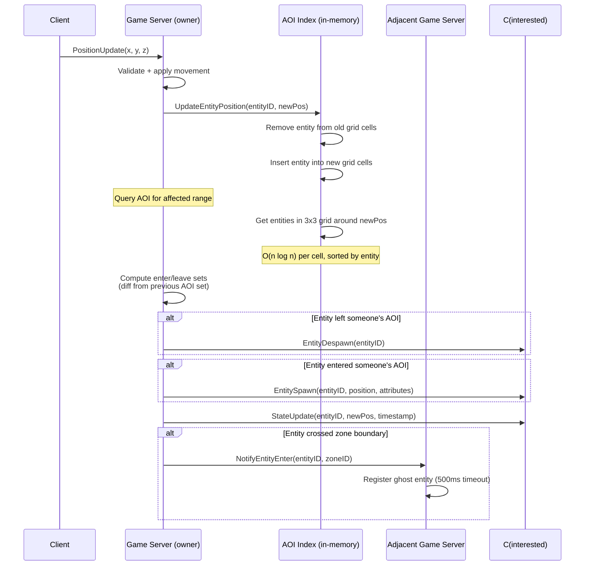
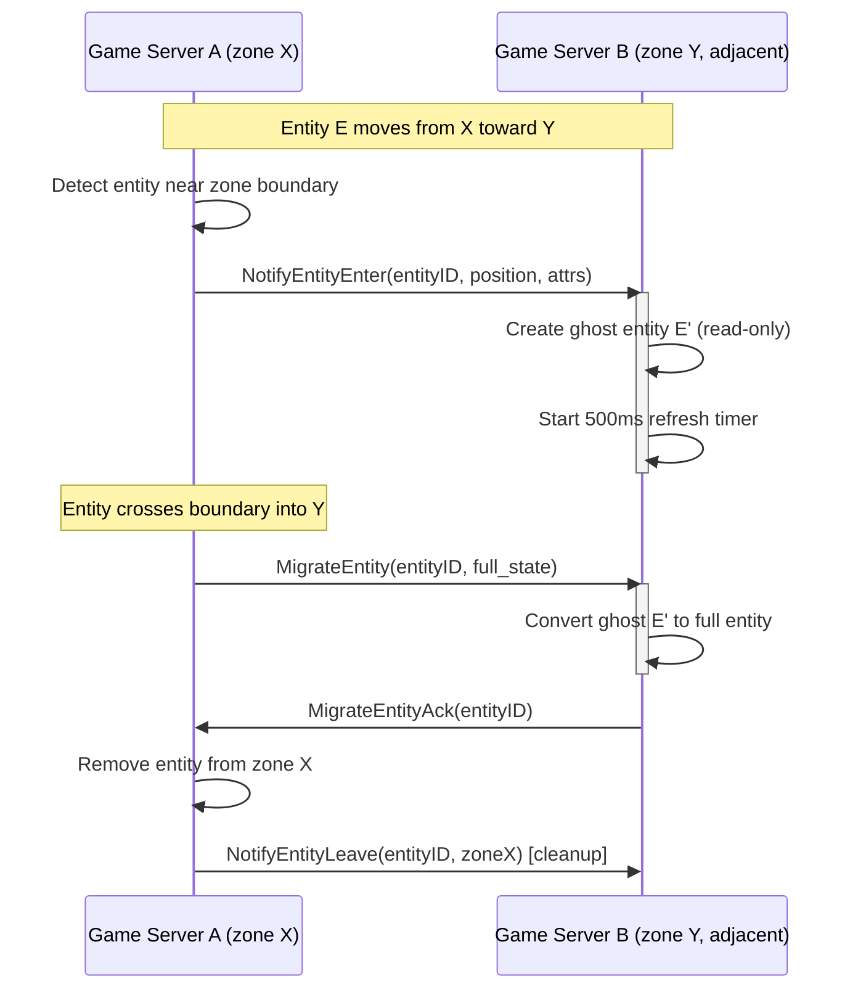
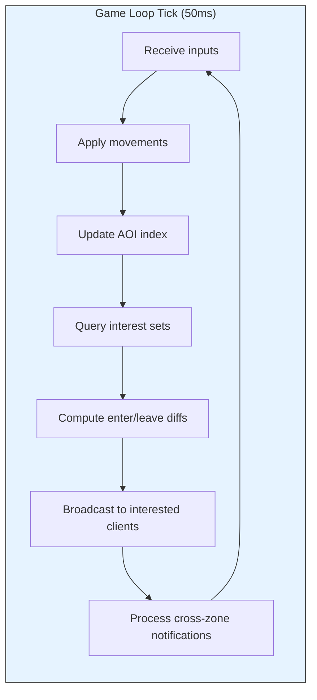

# AOI Architecture

> **Last Updated:** 2026-06-26

## Purpose

Area of Interest (AOI) is the system that determines which entities a given player can see and interact with. It is the core spatial awareness mechanism — every position update, entity spawn, and entity despawn decision flows through the AOI index. This document details the AOI design, query flow, cross-zone mechanics, and failure modes.

## Grid-Based AOI Design

Spatial Server uses a **grid-based** approach (not quadtree, not geohash) for its AOI index:

| Property | Value |
|----------|-------|
| Grid cell (zone) size | 100 × 100 world units (configurable) |
| Interest radius | 300 world units (configurable) |
| Cells queried per entity | 9 cells (3×3 grid centered on entity) |
| Query complexity | O(n log n) per cell (sorted by entity) |

The grid is the simplest spatial partitioning scheme that gives deterministic ownership boundaries. Each grid cell corresponds to a zone, and each zone is owned by exactly one Game Server (see ADR-001). The interest radius of 300 units with 100-unit cells means an entity at the center of a cell needs to see entities in its own cell plus all eight adjacent cells (3×3 = 9 cells total).

### In-Memory Spatial Index

The AOI index lives entirely in-memory on the Game Server — not in Redis or PostgreSQL:

```go
// Conceptual structure
type AOIIndex struct {
    zones map[ZoneID]*ZoneAOI  // per-zone spatial index
}

type ZoneAOI struct {
    entities map[EntityID]*Entity   // all entities in this zone
    grid     [][]EntitySet          // spatial grid cells within the zone
}
```

Key design decisions:
- **No external storage for AOI:** Realtime state never passes through Redis (see ADR-003). AOI queries must complete within the 50ms tick budget — a network round trip to Redis would add unacceptable latency.
- **Grid within a zone:** Within a single zone, entities are further subdivided into a finer grid for efficient local queries. This secondary grid is purely in-memory and does not correspond to zone boundaries.
- **Entity registration:** Every entity in a zone is registered in the AOI index. When an entity moves, the index is updated for its new position.

## AOI Query Flow



### Detailed Steps

1. **Position Update Received:** Client sends `PositionUpdate` protobuf via WebSocket → Gateway proxies to Game Server via gRPC.
2. **AOI Index Update:** Game Server removes entity from old grid cell(s) and inserts into new cell(s).
3. **Interest Set Recalculation:** Compute the set of entities within interest radius (3×3 grid cells). Compare with previous tick's interest set.
4. **Enter/Leave Events:** Entities that are new to the set trigger `EntitySpawn`. Entities that left trigger `EntityDespawn`.
5. **State Broadcast:** Position updates sent to all clients whose entities are in the interest set.
6. **Cross-Zone Notification:** If the entity moved into a grid cell near an adjacent zone boundary, the adjacent Game Server is notified.

## Cross-Zone AOI

AOI does not stop at zone boundaries. Entities near the edge of a zone must see entities in adjacent zones owned by different Game Servers.

### Adjacent Zone Subscriptions

When a Game Server starts, it identifies its zone's neighbors and establishes gRPC connections to their owning Game Servers. Each server maintains a set of "peer AOI subscriptions" — interest in entities owned by other servers that are within range of its local entities.

### Entity Enter/Leave Notifications

| Event | Trigger | Action |
|-------|---------|--------|
| `NotifyEntityEnter` | Entity moves within interest range of adjacent zone | Target Game Server registers a "ghost" entity (read-only reference) |
| `NotifyEntityLeave` | Entity moves out of interest range | Target Game Server removes ghost entity (or timeout) |
| `MigrateEntity` | Entity crosses zone boundary | Full entity state transfer to new owning Game Server |

### Ghost Entity Timeout (500ms)

Ghost entities are lightweight read-only references to entities owned by another Game Server. They have a 500ms timeout — if no update is received within 500ms, the ghost entity is removed. This handles:

- **Race conditions:** Both servers may briefly disagree on entity ownership during boundary crossing.
- **Lost notifications:** If a `NotifyEntityEnter` packet is dropped, the ghost times out and is cleaned.
- **Crash recovery:** If the owning Game Server crashes, ghost entities on peer servers auto-expire.

### Cross-Zone State Synchronization



## AOI Update Flow



### Tick Budget Allocation (50ms total @ 20Hz)

| Phase | Budget | Description |
|-------|--------|-------------|
| Input processing | 5ms | Deserialize client inputs, apply rate limiting |
| Movement + physics | 15ms | Apply position updates, collision detection (basic) |
| AOI index update | 3ms | Update spatial grid for moved entities |
| AOI query + diff | 12ms | Query interest sets, compute enter/leave |
| Broadcast | 10ms | Serialize and send updates to Gateways |
| Cross-zone sync | 5ms | Send/receive P2P notifications to/from peers |

If the tick exceeds 50ms for 10 consecutive ticks, a warning alert fires. If it exceeds 100ms, critical alert (game loop is starving).

### Broadcast Strategy

- **Full update every Nth tick:** Position updates for all entities in interest set, sent every N ticks (default N=1, configurable).
- **Delta updates:** Only entities whose state changed since last broadcast.
- **LOD (future):** Distant entities in the AOI set receive fewer updates per second than nearby entities.
- **Backpressure:** If Gateway send buffers are full, Game Server drops non-critical updates (position interpolation, cosmetic animations). Never block the game loop.

## Performance Characteristics

### Query Time vs Entity Count

Estimated AOI query performance at varying entity densities (100-unit grid, 300-unit interest radius):

| Entities per zone | Cells queried | Entities per cell | Query time (est.) |
|------------------|---------------|-------------------|-------------------|
| 10 | 9 | ~1 | <0.1ms |
| 50 | 9 | ~5 | ~0.5ms |
| 100 (limit) | 9 | ~11 | ~1ms |
| 200 (overload) | 9 | ~22 | ~3ms |
| 500 (extreme) | 9 | ~55 | ~10ms |

AOI query complexity is approximately O(e × log(e)) per cell where e is the entity count in each of the 9 cells. At the 100-entity-per-zone limit, AOI queries consume ~1ms of the tick budget — well within the 12ms allocation.

### Memory Per Entity

| Component | Size (est.) | Notes |
|-----------|-------------|-------|
| Entity struct | ~200 bytes | ID, position (3×float32), attributes pointer |
| AOI subscription set | ~100 bytes | Set of entity IDs this entity can see |
| AOI grid references | ~40 bytes | Pointers from grid cells |
| Ghost entity (cross-zone) | ~80 bytes | Read-only reference, no AOI set |
| **Total per entity** | **~420 bytes** | Well under 5KB target (includes overhead) |

At 5,000 entities per server: 5,000 × 420 bytes ≈ 2.1 MB for AOI state (plus ~2.9 MB for other entity state ≈ 5 KB/entity total).

### Update Frequency

| Update type | Frequency | Notes |
|-------------|-----------|-------|
| Client position report | 20 Hz (every tick) | Player movement |
| AOI index update | 20 Hz (on position change) | Grid cell updates |
| AOI query + broadcast | 20 Hz | Interest set per entity |
| Cross-zone notification | On boundary crossing | Event-driven, not tick-locked |
| Ghost entity refresh | 2 Hz (500ms timeout) | Soft state |

## Disaster Scenarios

### Game Server Crash (AOI State Lost)

```
1. Game Server A crashes
2. Room Service detects heartbeat timeout (15s)
3. Room Service marks zones owned by A as ORPHAN
4. Room Service assigns orphan zones to ACTIVE servers B, C
5. Servers B, C load zone state from PostgreSQL (last snapshot)
6. In-memory AOI index is rebuilt from loaded entity positions:
   a. Entities deserialized from zone_state table
   b. AOI grid reconstructed from entity positions
   c. Cross-zone subscriptions re-established
7. Ghost entities on peer servers (from NotifyEntityEnter) timeout (500ms)
   after last missed refresh from crashed server
8. Gateway routing table updated (pushed to all Gateway instances)
9. Players reconnect via Gateway → new Game Server → entity recreated
```

**Loss window:** Up to 5s of in-memory AOI state (between persistence intervals). Players may briefly see incorrect entity positions or missing entities until AOI is rebuilt and cross-zone subscriptions re-establish.

### Zone Transfer (AOI State Streamed)

When Room Service initiates a zone transfer (load balancing, scale-down):

```
1. Room Service sets zone status to TRANSFERRING
2. Source Game Server pauses AOI updates for the transferring zone
3. Source serializes full zone state:
   - Entity list (positions, attributes, metadata)
   - AOI index (entity→grid mapping)
   - Cross-zone subscriptions (peer server references)
4. Source streams serialized state to target via gRPC ZoneStateSync
5. Target loads state into in-memory AOI index:
   - Reconstruct AOI grid
   - Re-establish cross-zone subscriptions with adjacent servers
   - Notify peers: "I now own zone Z, send enter/leave notifications"
6. Target begins simulation, un-pauses AOI updates
7. Target confirms ownership → Room Service updates zones
8. Gateway routing table refreshed
9. Source releases zone resources
```

**Pause duration:** Approximately serialization time + RTT + target initialization. Target <2s for zones at capacity (100 entities). <5s for largest zones.

### Ghost Entity Leak

If peer Game Server notifications are lost (network partition, crash):

- Ghost entities on peer servers have a 500ms timeout
- Each ghost must be refreshed by the owning server within 500ms or it self-destructs
- During graceful operations, owning server sends periodic refresh pings
- After crash, ghosts time out within 500ms — no manual cleanup needed
- **Maximum ghost leak duration:** 500ms after owning server stops sending updates

### AOI Index Corruption

If the in-memory AOI index becomes inconsistent (bug):

- Per-zone validation: every 100 ticks, validate that entity positions are consistent with grid cell assignments
- If mismatch detected: rebuild the AOI index for that zone from entity positions (O(n))
- Worst case: AOI index rebuild causes one tick to exceed 50ms budget (acceptable for rare events)
- If rebuild fails: zone state is reloaded from PostgreSQL (fallback)

## References

- [ADR-003](../adr/003-aoi-strategy.md) — AOI Strategy
- [ADR-001](../adr/001-zone-ownership.md) — Zone Ownership
- [ADR-002](../adr/002-zone-migration.md) — Zone Migration
- [Architecture Overview](overview.md)
- [Component Responsibilities](component-responsibilities.md)
- [Performance Budget](performance-budget.md)
