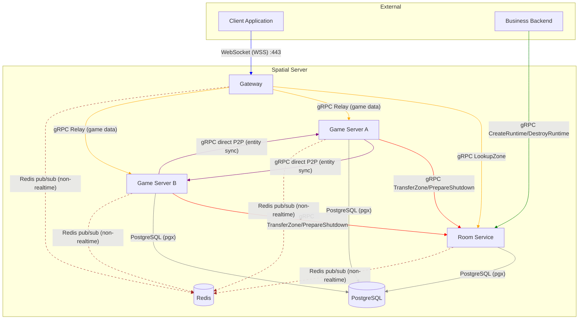

# Communication Patterns

> **Last Updated:** 2026-06-26

## Purpose

Defines the communication paths between all actors in the Spatial Server system — client-facing, internal service-to-service, and event-driven.

## Communication Diagram

> Control-plane RPCs (`TransferZone`, `PrepareShutdown`, `PrepareTransfer`, `Register`, `Heartbeat`) are called **by Game Server on Room Service**. Data-plane zone state flows via `GameServer.ZoneStateSync` (P2P per ADR-002).

## Communication Patterns

### 1. WebSocket (Client → Gateway)

- **Transport:** WSS (WebSocket over TLS 1.3)
- **Protocol:** Binary protobuf packets (length-prefixed, sequence-numbered)
- **Auth:** JWT runtime token (presented on connect, validated by Gateway)
- **Purpose:** All client ↔ server realtime communication
- **Details:** See [WebSocket Protocol](../protocol/websocket.md)

### 2. gRPC Direct P2P (Game Server ↔ Game Server)

- **Transport:** gRPC over HTTP/2 (private network, no load balancer)
- **Purpose:** Realtime entity sync between adjacent zones:
  - `MigrateEntity` — entity crosses zone boundary
  - `ZoneStateSync` — zone transfer state streaming
  - `NotifyEntityEnter` / `NotifyEntityLeave` — AOI boundary crossing
- **Latency target:** <5ms p99 within same datacenter
- **Retry:** None or minimal — realtime data is ephemeral (latest update wins)
- **Connection:** Long-lived keep-alive between frequently communicating pairs

### 3. gRPC Gateway Proxying (Client → Gateway → Game Server)

- **Transport:** WebSocket (client-facing) → Gateway translates to gRPC (internal)
- **Purpose:** Client not connected directly to Game Server. Gateway:
  1. Receives binary protobuf packet from client
  2. Deserializes, validates, looks up target Game Server (from cached routing table)
  3. Forwards to Game Server via gRPC
  4. Routes Game Server responses back to client WebSocket
- **Routing:** Stateless — Gateway caches zone→GameServer mapping (TTL: 5s, pushed on change)
- **Note:** The Gateway is a plain HTTP/WebSocket server (no gRPC service). Client packet relay uses the `GameServer.Relay` bidi stream. The empty `Gateway` proto service is unused.

### 4. gRPC Coordinator (Gateway/Game Server → Room Service)

- **Transport:** gRPC over HTTP/2 (private network)
- **Purpose:** Control-plane operations (all RPCs below are defined on `RoomService`):
  - Gateway → Room Service: `LookupZone(zoneID) → GameServerAddress`
  - Game Server → Room Service: `Register`, `Heartbeat`, `PrepareShutdown`, `TransferZone`, `PrepareTransfer`
- **Note:** `TransferZone`/`PrepareTransfer`/`PrepareShutdown` are called **by Game Server on Room Service**, not the reverse. Data-plane zone state flows via `GameServer.ZoneStateSync` (P2P per ADR-002).

### 5. Event Bus (Redis pub/sub — Non-Realtime)

- **Transport:** Redis pub/sub
- **Rule:** Realtime synchronization must **never** depend on an event bus.
- **Use Cases:**
  - Domain events (runtime created/destroyed)
  - Analytics events (player count changes)
  - Logging events (non-critical operational logs)
  - Configuration changes (dynamic config updates)
- **Why not for realtime:** Redis pub/sub offers at-most-once delivery, no ordering guarantees, and no backpressure — all incompatible with realtime state synchronization.

### 6. Database (PostgreSQL + Redis)

- **PostgreSQL:** Source of truth for runtime metadata, zone ownership, Game Server registry. All services connect via pgx connection pool.
- **Redis:** Session cache, metadata cache, non-realtime pub/sub. Not used for gameplay state.
- **PostgreSQL write path:** Always to primary. Read replicas for analytics only.
- **Redis cluster:** Sentinel in staging, Cluster in production with data sharding.

## Key Design Rules

| Rule | Rationale |
|------|-----------|
| No hot-path dependency on Room Service | Gateway caches routing table (5s TTL + push updates). Gameplay continues during Room Service outage. |
| No central router for game data | Game Servers communicate directly P2P — Room Service is metadata-only. Avoids bottleneck. |
| No synchronous calls to Business Backend | Business Backend is decoupled during gameplay. JWT pre-validation is sufficient. |
| No event bus for realtime state | Redis pub/sub lacks delivery guarantees needed for entity synchronization. |
| gRPC timeouts per-RPC | Different operations have different latency requirements (500ms for entity updates, 30s for zone transfers). |

## References

- [ADR-004](../adr/004-coordinator.md) — Coordinator Pattern (Room Service as lightweight coordinator)
- [ADR-009](../adr/009-rpc-contract.md) — RPC Contract (full protobuf definitions)
- [ADR-012](../adr/012-networking.md) — Network Segmentation
- [Overview](overview.md) — Architecture overview
- [WebSocket Protocol](../protocol/websocket.md) — Client-facing protocol details
