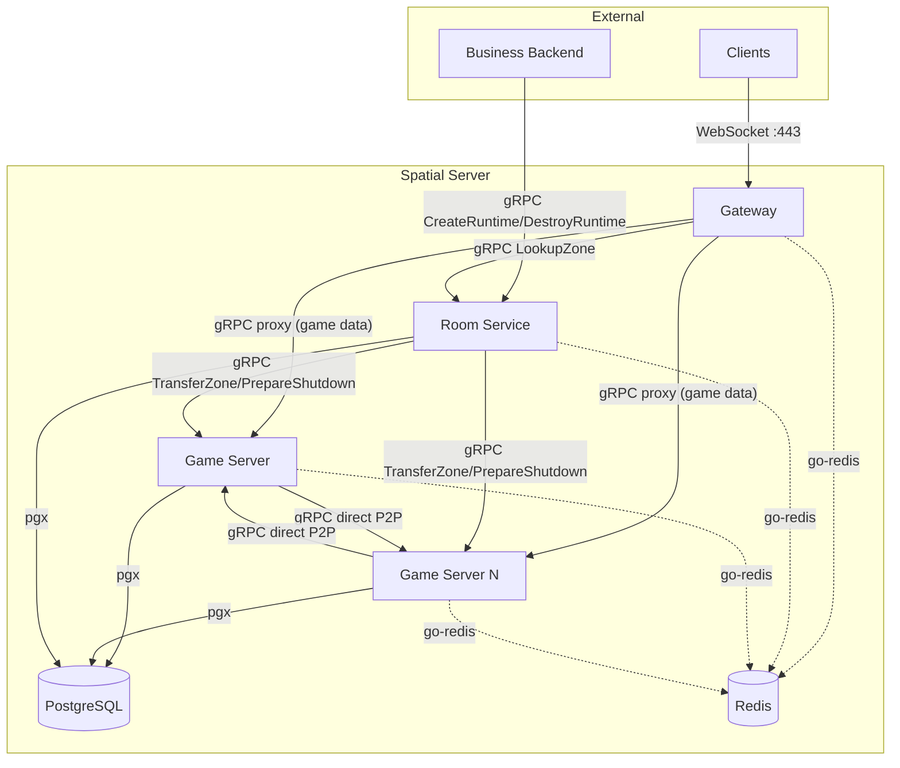

# Component Responsibilities

> **Last Updated:** 2026-06-26

## Purpose

Detailed responsibility boundaries for each component in the Spatial Server platform.

## Component Diagram

## Gateway

### Purpose

WebSocket termination layer that handles all client-facing connections. Acts as a stateless proxy between clients and Game Servers.

### Responsibilities

- Terminate WebSocket connections (nhooyr.io) with TLS
- Validate JWT runtime tokens (ECDSA signature verification against Business Backend public key)
- Rate-limit connections and messages per client (default: 100 msg/s per connection)
- Route client traffic to the correct Game Server via cached zone lookup
- Translate WebSocket binary protobuf packets to internal gRPC calls
- Buffer and replay messages during Game Server handoff
- Expose `/health` and `/metrics` endpoints for orchestration and observability
- Drain connections gracefully during scale-in (stop accepting new, wait for active to drop)

### Non-Responsibilities

- Does NOT own or store zone ownership data (cached from Room Service with 5s TTL only)
- Does NOT hold any session affinity — fully stateless
- Does NOT parse or interpret game-level protobuf payloads (opaque pass-through)
- Does NOT authenticate users (only validates JWT tokens issued by Business Backend)
- Does NOT initiate any communication — responds to client requests only

### Dependencies

- Room Service for zone lookup (gRPC, cached)
- Game Server for game data proxying (gRPC)
- Redis for session cache (optional, for rate-limit counters)
- Business Backend's public key (configuration, fetched at startup)

### Failure Mode

- Gateway crash: all WebSocket connections on that instance drop. Clients reconnect via load balancer → new Gateway looks up zone → proxies to Game Server (Game Server sees reconnect as new connection)
- Gateway is behind a load balancer (LB health check → remove failed instance → connections drain to remaining instances)
- **User-visible impact:** Brief interruption (reconnect), no data loss

### Scaling

- **Strategy:** Horizontal, stateless. Add/remove instances behind LB.
- **Limit:** 10,000 concurrent connections per instance (file descriptors + goroutine overhead)
- **Scale trigger:** CPU >70% for 30s OR connections >8,000 for 30s
- **Scale action:** Deploy new pod → register with LB → traffic distributes automatically
- **Scale-in:** Drain connections, remove from LB, terminate

### State

- **Stateless** — no in-memory or persistent state
- Caches zone→GameServer mapping (TTL: 5s, pushed on ownership change)

## Room Service

### Purpose

Lightweight metadata coordinator that manages zone ownership, Game Server registry, and routing hints. It is explicitly NOT a data-plane router.

### Responsibilities

- Maintain the zone → Game Server ownership table (source of truth in PostgreSQL)
- Assign zones to Game Servers on `CreateRuntime` (lowest-load-first)
- Track Game Server health via heartbeats (5s interval, 3-miss timeout = 15s)
- Detect and reassign orphan zones after Game Server crash (heartbeat timeout)
- Initiate zone transfers for load balancing and scale-in/down
- Respond to `LookupZone` queries from Gateways
- Accept `CreateRuntime` / `DestroyRuntime` from Business Backend
- Elect a leader via K3s Lease API in production (active/passive HA)

### Non-Responsibilities

- Does NOT route or proxy any game data (no data-plane traffic)
- Does NOT handle WebSocket connections
- Does NOT run game simulation ticks
- Does NOT store entity state or AOI data
- Does NOT perform authentication (delegated to Gateway JWT validation)

### Dependencies

- PostgreSQL for zone ownership and Game Server registry (authoritative writes)
- Game Servers for heartbeats and zone transfer coordination (gRPC)
- Gateway for zone lookups (gRPC, cached on Gateway side)

### Failure Mode

- Room Service leader crash: follower takes over within <5s (K3s Lease API leader election). Gateway routing cache (5s TTL) covers short outages — existing gameplay continues uninterrupted
- During full Room Service outage:
  - New `CreateRuntime` / `DestroyRuntime` calls fail (Business Backend must retry)
  - New zone lookups fail (Gateway cache may miss for cold zones)
  - Existing gameplay continues (Gateway cache + direct P2P still work)
  - Game Server heartbeats fail silently — Room Service cannot detect crashes
- **User-visible impact:** Only runtime creation/destruction and new connections affected during outage. Active gameplay uninterrupted.

### Scaling

- **Strategy:** Active/passive HA pair with leader election. Not expected to scale beyond 2 replicas.
- **Limit:** 100 Game Servers, 1,000 runtimes, 10K lookups/s (metadata only)
- **Scale trigger:** Not anticipated — if throughput exceeds capacity, investigate load pattern first
- **Read scaling:** Follower can serve `LookupZone` reads if needed

### State

- **Lightweight metadata** — zone ownership table, Game Server registry in PostgreSQL
- In-memory cache for fast lookups (rebuilt on leader restart from PostgreSQL)

## Game Server

### Purpose

Core simulation engine that owns zones, runs the game loop, maintains entity state, and manages AOI (Area of Interest) for spatial awareness.

### Responsibilities

- Own and simulate one or more zones (grid cells)
- Maintain in-memory entity state (position, attributes, subscriptions)
- Run the game loop at 20Hz tick rate (50ms budget)
- Execute AOI queries from in-memory spatial index
- Broadcast entity state updates to interested clients (within interest radius)
- Handle direct P2P gRPC calls from peer Game Servers (entity migration, zone state sync)
- Persist zone state to PostgreSQL periodically (default 5s interval)
- Register with Room Service on startup and send heartbeats every 5s
- Accept and execute zone transfer commands from Room Service (source/target roles)
- Handle player join (create entity, add to AOI) and leave (remove entity, broadcast despawn)
- Enforce per-zone entity capacity (default 100 entities)

### Non-Responsibilities

- Does NOT handle WebSocket connections directly (proxied through Gateway)
- Does NOT make zone ownership decisions (Room Service is the authority)
- Does NOT authenticate players (JWT validated by Gateway)
- Does NOT store business metadata (room names, user profiles, permissions)
- Does NOT communicate with Business Backend directly
- Does NOT depend on Redis for realtime data (AOI is in-memory)

### Dependencies

- Room Service for registration, heartbeat, zone assignment (gRPC)
- Gateway for client traffic (gRPC proxy)
- Peer Game Servers for cross-zone entity sync (direct P2P gRPC)
- PostgreSQL for zone state persistence and crash recovery
- Redis for non-realtime events only (pub/sub, domain events)

### Failure Mode

- Game Server crash: Room Service detects via heartbeat timeout (15s). Orphan zones reassigned to ACTIVE servers. New owners load last persisted state from PostgreSQL. Ghost entities cleaned on next AOI sweep. Up to 5s of in-memory state lost (between persistence intervals)
- Graceful shutdown: zones transferred to peers via streaming gRPC. No state loss. Zero-downtime for players in transferred zones
- Network partition: Game Server isolated from Room Service but still reachable by Gateway. Gameplay continues until heartbeat timeout triggers ownership reassignment. Split-brain prevented by PostgreSQL ownership write (unique constraint)
- **User-visible impact on crash:** Brief pause (few seconds) while zone reassigned and state reloaded; players may need to reconnect via Gateway. Position/state rollback to last persisted snapshot.

### Scaling

- **Strategy:** Horizontal, coordinator-managed. Room Service decides when to add/remove Game Servers.
- **Limit:** 5,000 entities per server (100 entities/zone × 50 zones)
- **Scale trigger:** CPU >70% for 30s OR memory >80% for 30s OR zone imbalance stddev >30%
- **Scale action:** Spawn new pod → register → Room Service transfers zones from overloaded servers
- **Scale-in:** Room Service selects drain candidate → all zones transferred → server terminates
- **Zone rebalance:** Room Service may trigger rebalance without changing server count (redistribute zones when stddev >30%)

### State

- **In-memory (primary)** — entity positions/attributes, AOI spatial index, client subscriptions
- **PostgreSQL (persistence)** — zone state snapshots (periodic, every 5s)

## PostgreSQL

### Purpose

Operational source of truth for all metadata — zone ownership, Game Server registry, runtime lifecycle state. Not used for gameplay state in the hot path.

### Data Stored

| Table | Description | Write Pattern |
|-------|-------------|--------------|
| `zone_ownership` | zone_id → server_id mapping with status and heartbeat | Room Service (exclusive writer) |
| `game_servers` | Game Server registry (address, capacity, load, joined_at) | Room Service |
| `runtimes` | Runtime metadata (status, zone count, timestamps) | Room Service |
| `zone_state` | Serialized zone snapshots for crash recovery | Game Servers (periodic, 5s) |

### Access Pattern

- **Room Service:** Authoritative writer for ownership, registry, and runtime tables
- **Game Server:** Periodic zone state persistence (write); crash recovery (read)
- **Gateway:** Does NOT connect to PostgreSQL directly
- **Business Backend:** Does NOT connect to PostgreSQL directly (communicates via Room Service gRPC)
- **Redis:** PostgreSQL is NOT accessed via Redis — Redis is a separate cache layer

### Failure Mode

- Primary crash: PgBouncer or connection pool detects failure → auto-failover to replica (streaming replication). Brief write unavailability (seconds). Reads from replica continue if configured
- Replica lag (<100ms target): Read-after-write consistency not guaranteed on replicas — hot-path reads use primary
- Split-brain: Not expected — PostgreSQL manages its own replication. If occurs, zone ownership tiebreaker via advisory lock
- **User-visible impact:** Brief pause during failover. Existing gameplay continues (Gateway cache covers lookups, Game Servers continue simulation)

## Redis

### Purpose

Cache layer and non-realtime event bus. Used for session caching, metadata caching, and pub/sub for domain events. Never holds gameplay state.

### Data Stored

| Key Space | Description | TTL |
|-----------|-------------|-----|
| `session:{player_id}` | Player session cache | 5 minutes |
| `cache:zone:{zone_id}` | Zone metadata cache | TTL varies |
| `cache:runtime:{runtime_id}` | Runtime metadata cache | TTL varies |
| `rate:limit:{player_id}` | Rate-limit counters | Rolling window |

### Access Pattern

- **Gateway:** Session cache reads, rate-limit counters (increment + check)
- **Room Service:** Metadata cache (reduce PostgreSQL reads)
- **Game Server:** Non-realtime pub/sub only (analytics, domain events, config changes)
- **AOI:** Does NOT use Redis — AOI index is in-memory on Game Server

### Failure Mode

- Primary failure (Sentinel): Auto-failover to replica in <10s. Cache misses cause increased PostgreSQL load but no data loss (cache is disposable)
- Cluster node failure (Redis Cluster): Partial cache unavailability for sharded keys. Reads route to remaining replicas
- Full Redis outage: Gateway rate-limiting falls back to local counters (less accurate, still functional). Pub/sub events lost (non-critical). Metadata queries fall through to PostgreSQL (increased latency)
- Redis restart: Cache is cold. Gradual warm-up as services repopulate. Pub/sub subscribers must re-subscribe
- **User-visible impact:** No direct impact during Redis outage — gameplay continues. Slightly higher latency on connection and metadata lookups

## References

- [ADR-001](../adr/001-zone-ownership.md) — Zone Ownership
- [ADR-003](../adr/003-aoi-strategy.md) — AOI Strategy
- [ADR-004](../adr/004-coordinator.md) — Coordinator Pattern
- [ADR-005](../adr/005-game-server-registration.md) — Game Server Registration
- [ADR-006](../adr/006-game-server-lifecycle.md) — Game Server Lifecycle
- [ADR-013](../adr/013-platform-boundary.md) — Platform Boundary
- [Architecture Overview](overview.md)
