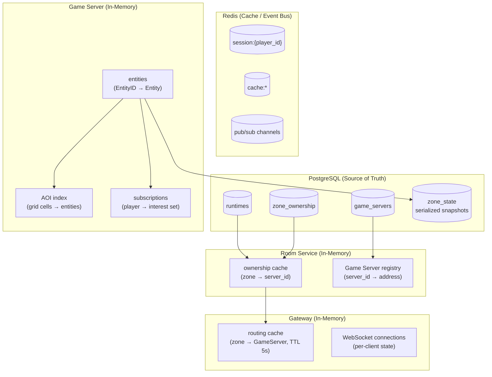

# Data Model

> **Last Updated:** 2026-06-26

## Purpose

Document all data entities in the Spatial Server system, their fields, storage location, and lifecycle. This is the authoritative reference for what data exists, where it lives, and how it flows between components.

## Data Flow Diagram



## Runtime

A runtime is an instantiated realtime session corresponding to a business entity (room/showroom/meeting). It is the top-level lifecycle unit.

| Field | Type | Storage | Description |
|-------|------|---------|-------------|
| `runtime_id` | UUIDv7 | PostgreSQL (`runtimes`) | Unique identifier |
| `status` | enum | PostgreSQL (`runtimes`) | `creating`, `active`, `draining`, `destroyed` |
| `zone_count` | integer | PostgreSQL (`runtimes`) | Number of zones (grid cells) allocated |
| `player_count` | integer | PostgreSQL (`runtimes`) | Current connected player count |
| `created_at` | timestamp | PostgreSQL (`runtimes`) | Creation time |
| `updated_at` | timestamp | PostgreSQL (`runtimes`) | Last status change |
| `destroyed_at` | timestamp (nullable) | PostgreSQL (`runtimes`) | Destruction time (set when status = `destroyed`) |
| `metadata` | JSONB (nullable) | PostgreSQL (`runtimes`) | Optional Business Backend metadata (opaque to Spatial Server) |

**Lifecycle:** Created by `CreateRuntime` gRPC → transitions through states (creating → active → draining → destroyed). Destroyed records may be retained briefly for audit, then pruned by TTL.

**Storage:** PostgreSQL is the source of truth. Redis may cache runtime metadata for lookups (TTL-bounded). In-memory on Room Service (leader cache).

## Zone

A zone is a grid cell within a runtime. Each zone is owned by exactly one Game Server at any time.

| Field | Type | Storage | Description |
|-------|------|---------|-------------|
| `zone_id` | UUIDv7 | PostgreSQL (`zone_ownership`) | Unique identifier |
| `runtime_id` | UUIDv7 | PostgreSQL (`zone_ownership`) | Parent runtime |
| `server_id` | UUIDv7 (nullable) | PostgreSQL (`zone_ownership`) | Owning Game Server ID |
| `grid_x` | integer | PostgreSQL (`zone_ownership`) | Grid column index |
| `grid_y` | integer | PostgreSQL (`zone_ownership`) | Grid row index |
| `status` | enum | PostgreSQL (`zone_ownership`) | `unowned`, `active`, `transferring`, `orphan` |
| `heartbeat_expires_at` | timestamp (nullable) | PostgreSQL (`zone_ownership`) | Ownership lease expiration |
| `entity_count` | integer | PostgreSQL (`zone_ownership`) | Current entity count (approximate) |
| `created_at` | timestamp | PostgreSQL (`zone_ownership`) | Creation time |
| `last_persisted_at` | timestamp (nullable) | PostgreSQL (`zone_state`) | Last snapshot time |

**Lifecycle:** Created with runtime → assigned to a Game Server (`active`) → may transfer between servers (`transferring` → `active`) → on Game Server crash becomes `orphan` → reassigned → on runtime destroy, zone records deleted.

**Storage:** PostgreSQL is the source of truth for ownership. Zone state snapshots (serialized entity data) stored in `zone_state` table. AOI index is purely in-memory on the owning Game Server and does NOT exist in PostgreSQL or Redis.

## Entity

An entity is a dynamic object simulated within a runtime — a player, NPC, item, or any interactive object. *(Currently only `player` entities are implemented; `npc` exists as a static demo seed only.)*

| Field | Type | Storage | Description |
|-------|------|---------|-------------|
| `entity_id` | UUIDv7 | In-memory (+ serialized to `zone_state`) | Unique identifier |
| `zone_id` | UUIDv7 | In-memory (+ serialized to `zone_state`) | Owning zone |
| `owner_id` | string (nullable) | In-memory | Player ID if player-controlled, null if NPC |
| `type` | enum | In-memory (+ serialized to `zone_state`) | `player`, `npc`, `item`, `prop` |
| `position_x` | float32 | In-memory (+ serialized to `zone_state`) | World X coordinate |
| `position_y` | float32 | In-memory (+ serialized to `zone_state`) | World Y coordinate |
| `position_z` | float32 | In-memory (+ serialized to `zone_state`) | World Z coordinate |
| `rotation` | float32[4] (quaternion) | In-memory (+ serialized to `zone_state`) | Entity rotation |
| `velocity` | float32[3] | In-memory (+ serialized to `zone_state`) | Movement vector |
| `attributes` | map[string]any | In-memory (+ serialized to `zone_state`) | Arbitrary key-value state |
| `created_at` | int64 (unix millis) | In-memory (+ serialized to `zone_state`) | Entity creation timestamp |
| `last_updated_at` | int64 (unix millis) | In-memory | Last state change |

**Entity ID:** UUIDv7 — provides time-ordered unique IDs with no central counter. The v7 format encodes a Unix millisecond timestamp in the most significant bits, enabling rough time-based sorting without a separate timestamp index.

**Lifecycle:** Created when a player joins (or NPC/item is spawned). Lives in-memory on the owning Game Server. Updated every tick (position, attributes). Serialized to PostgreSQL at configurable intervals (default 5s) *(not yet implemented — entities are in-memory only)*. Destroyed when player leaves or entity despawns.

**Storage:** Primary storage is **in-memory** on the Game Server. Serialized to the `zone_state` PostgreSQL table for crash recovery. Redis does NOT store entity state. Entity data never passes through Redis.

## Player

A player is a human participant connected to a runtime. A player has a session on the Gateway and an entity on the Game Server — these are separate but linked concepts.

| Field | Type | Storage | Description |
|-------|------|---------|-------------|
| `player_id` | string | JWT token (set by Business Backend) | Unique player identifier |
| `runtime_id` | UUIDv7 | JWT token | Runtime the player joins |
| `entity_id` | UUIDv7 | In-memory (+ session cache) | Linked entity on Game Server |
| `gateway_id` | string | Gateway (in-memory) | Which Gateway instance handles the connection |
| `connected_at` | timestamp | Gateway (in-memory) | Connection time |
| `session_ttl` | duration | Redis (`session:*`, TTL 5min) | Session cache expiry |
| `rate_limit_budget` | counter | Redis (`rate:limit:*`, rolling window) | Message rate-limit counter |

**Lifecycle:** Player authenticates with Business Backend → receives JWT → connects to Gateway → Gateway validates JWT → proxies to Game Server → Game Server creates entity → entity registered in AOI. On disconnect: entity removed from AOI, session cache invalidated.

**Storage:** Session state is on Gateway (in-memory, per-connection). Redis caches session metadata for reconnect scenarios (5-minute TTL). Rate-limit state is in Redis (rolling window counters). Entity counterpart is in-memory on Game Server.

### Player <-> Entity Relationship

```
Player (auth concept, Business Backend owns)
  │
  ├── JWT token (player_id, runtime_id, exp)
  │
  └── Gateway session (WebSocket connection, in-memory)
        │
        └── gRPC proxy
              │
              └── Game Server entity (in-memory)
                    │
                    ├── AOI index (position-based)
                    └── Interest set (entities this player can see)
```

One player = one Gateway connection = one Game Server entity. There is a 1:1:1 relationship.

## Game Server

A Game Server is a process (container/pod) that owns zones and runs the game loop.

| Field | Type | Storage | Description |
|-------|------|---------|-------------|
| `server_id` | UUIDv7 | PostgreSQL (`game_servers`) | Unique server identifier |
| `address` | string (host:port) | PostgreSQL (`game_servers`) | gRPC endpoint address |
| `status` | enum | PostgreSQL (`game_servers`) | `joining`, `active`, `draining`, `shutdown` |
| `capacity` | integer (max zones) | PostgreSQL (`game_servers`) | Maximum zones this server can own |
| `load` | float | PostgreSQL (`game_servers`) | Current load metric (0.0–1.0) |
| `zone_count` | integer | PostgreSQL (`game_servers`) | Current zone count |
| `entity_count` | integer | PostgreSQL (`game_servers`) | Current entity count |
| `joined_at` | timestamp | PostgreSQL (`game_servers`) | Registration time |
| `last_heartbeat_at` | timestamp | PostgreSQL (`game_servers`) | Last heartbeat time |
| `version` | string | PostgreSQL (`game_servers`) | Software version for rolling updates |

**Lifecycle:** Process starts → resolves Room Service via DNS → sends `Register` gRPC → status = `joining` → assigned first zone → status = `active` → receives `PrepareShutdown` → status = `draining` → all zones transferred → status = `shutdown` → process exits. On crash: Room Service detects heartbeat timeout (15s) → marks as `lost` → reassigns zones.

**Storage:** Registry in PostgreSQL (source of truth). Room Service caches entire registry in-memory. Heartbeat state is in-memory on Room Service leader (loss acceptable — rebuild from DB on failover).

## Data Serialization

| Entity | Serialization Format | Serialized Where | Frequency |
|--------|---------------------|------------------|-----------|
| Entity state (for persistence) | Protobuf → binary | Game Server → PostgreSQL | Every 5s |
| Entity state (for zone transfer) | Protobuf → gRPC stream | Game Server A → Game Server B | On zone transfer |
| Zone ownership | Protobuf → PostgreSQL row | Room Service → PostgreSQL | On change |
| Game Server registry | Protobuf → PostgreSQL row | Room Service → PostgreSQL | On register/heartbeat |
| Session cache | Protobuf → binary (Redis value) | Gateway → Redis | On connect/reconnect |
| Client packets | Protobuf (length-prefixed) | Client ↔ Gateway | 20Hz |

## Storage Matrix

| Entity | PostgreSQL | Redis | In-Memory (GS) | In-Memory (GW) | In-Memory (RS) |
|--------|------------|-------|----------------|----------------|----------------|
| Runtime | Source of truth | Cache (TTL) | — | — | Leader cache |
| Zone ownership | Source of truth | Cache (TTL) | — | Cache (TTL 5s) | Leader cache |
| Entity state | Persisted snapshot (5s) | — | Primary storage | — | — |
| AOI index | — | — | Primary storage | — | — |
| Player session | — | Cache (TTL 5min) | Entity only | Primary (per-conn) | — |
| Game Server reg | Source of truth | — | — | — | Leader cache |

## References

- [ADR-001](../adr/001-zone-ownership.md) — Zone Ownership
- [ADR-003](../adr/003-aoi-strategy.md) — AOI Strategy
- [ADR-005](../adr/005-game-server-registration.md) — Game Server Registration
- [ADR-016](../adr/016-runtime-lifecycle.md) — Runtime Lifecycle
- [Architecture Overview](overview.md)
- [Component Responsibilities](component-responsibilities.md)
