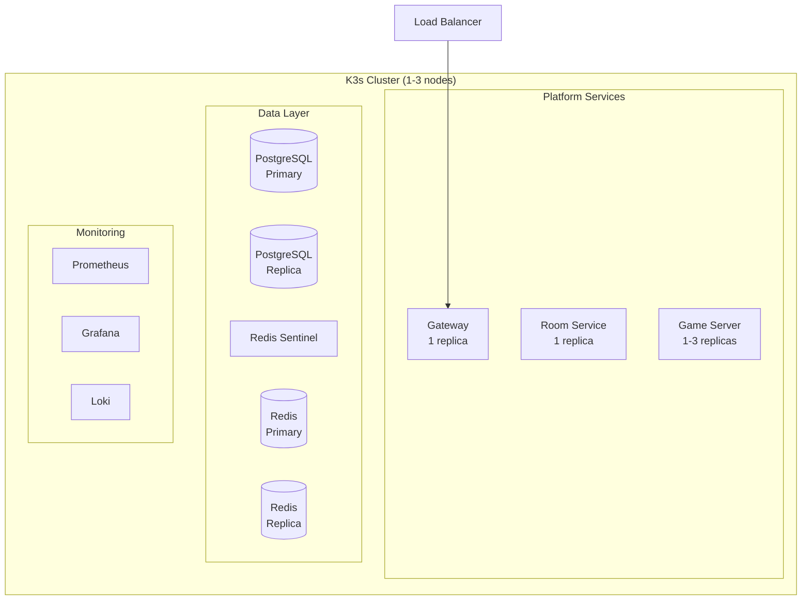
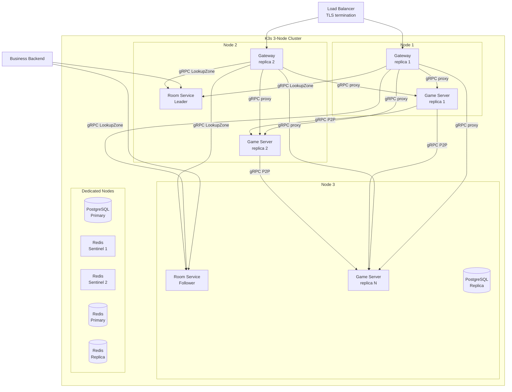
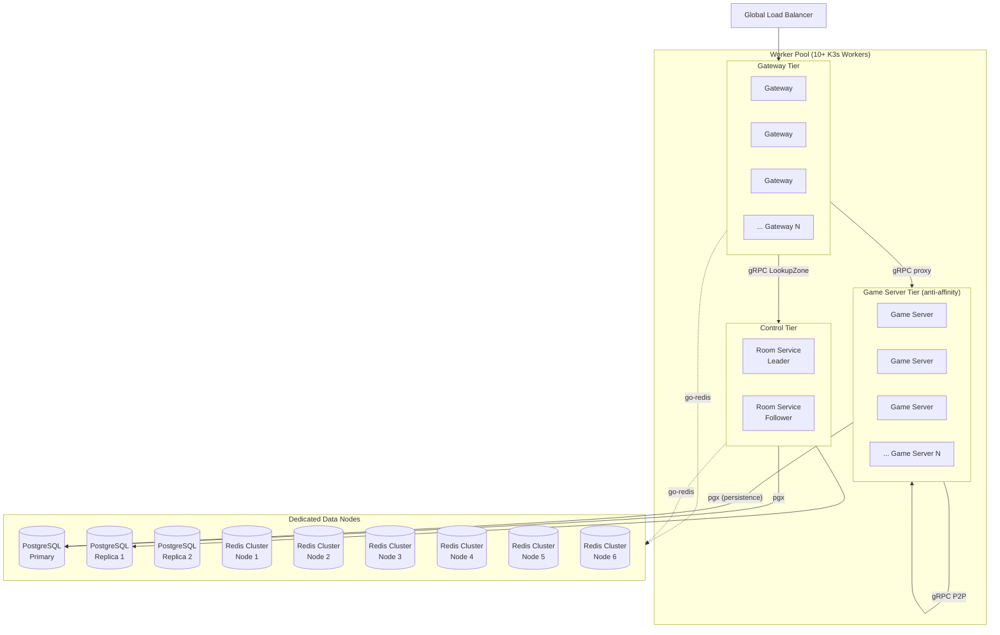
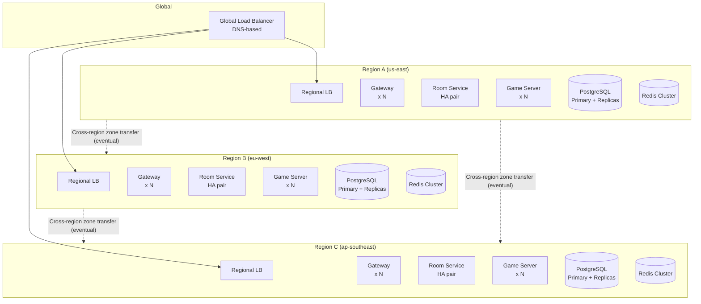

# Deployment Topology

> **Last Updated:** 2026-06-26

## Purpose

Defines the deployment topologies for each environment — local development, staging, and production at various scales. Each topology specifies how services are distributed, what infrastructure is required, and how they differ from each other.

## Topology Overview

| Environment | K3s Nodes | Gateway | Room Service | Game Server | PostgreSQL | Redis |
|-------------|-----------|---------|-------------|-------------|------------|-------|
| Local Dev | 0 (Docker Compose) | 1 replica | 1 instance | 1 replica | 1 instance | 1 instance (standalone) |
| Staging | 1–3 nodes | 1 replica | 1 replica | 1–3 replicas | 1 primary + 1 replica | Sentinel (1 primary + 2 replicas) |
| Production (MV) | 3 nodes | 2 replicas | 2 replicas (HA) | N replicas (autoscaled) | 1 primary + 1 replica | Sentinel |
| Production (Scale) | 10+ workers | 5–20 replicas | 2 replicas (HA) | N replicas (autoscaled) | 1 primary + N replicas | Redis Cluster |
| Multi-Region (Future) | Per-region clusters | Per-region replicas | Per-region | Per-region | Per-region | Per-region |

## Local Development

```mermaid
graph TB
  subgraph DevMachine["Development Machine (Docker Compose)"]
    subgraph Network["spatial-dev-network"]
      GW[Gateway<br/>:8080 (WSS)]
      RS[Room Service<br/>:9000 (gRPC)]
      GS[Game Server<br/>:9000 (gRPC)]
      PG[(PostgreSQL<br/>:5432)]
      RD[(Redis<br/>:6379)]
    end
  end

  CL[Client App] -- "ws://localhost:8080" --> GW
  BB[Business Backend] -- "localhost:9000" --> RS

  GW -- "gRPC" --> RS
  GW -- "gRPC" --> GS
  RS -- "gRPC" --> GS

  GS -- "pgx" --> PG
  RS -- "pgx" --> PG

  GW -. "go-redis" .-> RD
  RS -. "go-redis" .-> RD
  GS -. "go-redis" .-> RD
```

### Configuration

| Property | Value |
|----------|-------|
| Orchestration | Docker Compose |
| TLS | None (ws://, not wss://) |
| Load balancer | None |
| Service discovery | Docker DNS (service names) |
| Hot reload | Yes (docker compose watch) |
| PostgreSQL | Single instance, no replication |
| Redis | Standalone, no persistence |
| Room Service HA | Single instance, no leader election |
| Game Server scaling | `make scale-up` (named nodes) or `--scale game-server=N` (degenerate; see ADR-027) |

### Startup

```bash
make dev-up-full   # docker compose -f deploy/docker-compose/compose.yaml -f deploy/docker-compose/compose.app.yaml up -d
```

Services start in dependency order: PostgreSQL → Redis → Room Service → Game Server → Gateway. All services connect to each other via Docker DNS names.

### Limitations

- Single host — no network latency, no packet loss
- No TLS — JWT sent in cleartext
- No load balancing — Gateway is single point of entry
- No HA — any service restart drops connections
- No autoscaling — manual scale via compose
- Game Server peer discovery limited (single host networking)

## Staging



### Configuration

| Property | Value |
|----------|-------|
| Orchestration | K3s single or multi-node |
| TLS | Yes (Let's Encrypt via cert-manager) |
| Load balancer | K3s Service (NodePort/LoadBalancer) or external LB |
| PostgreSQL | Primary + 1 replica (streaming replication) |
| Redis | Sentinel topology (1 primary, 2 replicas) |
| Room Service HA | Single instance (leader election not critical in staging) |
| Monitoring | Prometheus + Grafana + Loki |
| Logging | Structured JSON → Loki |

### Purpose

- Integration testing with realistic network conditions
- Performance testing against production-like data layer
- Schema migration validation
- Monitoring and alerting configuration testing

## Production (Minimum Viable)



### Configuration

| Property | Value |
|----------|-------|
| Orchestration | K3s 3-node cluster |
| TLS | Yes (cert-manager + Let's Encrypt, or internal CA) |
| Load balancer | External (HAProxy, Nginx, or cloud LB) |
| Gateway replicas | 2 (behind LB, max 20K concurrent connections) |
| Room Service replicas | 2 (HA pair, leader election via K3s Lease API) |
| Game Server replicas | N (autoscaled, PodDisruptionBudget: min 1 available) |
| PostgreSQL | Primary + 1 replica (streaming replication, auto-failover) |
| Redis | Sentinel topology (1 primary, 2 replicas per sentinel) |
| Monitoring | Prometheus + Grafana + Loki + Alertmanager |
| Logging | Structured JSON → Promtail → Loki |
| Tracing | OpenTelemetry (optional, sampling rate 1%) |

### Key Properties

- **No single point of failure:** Gateway behind LB, Room Service in HA pair, PostgreSQL with replica, Redis with Sentinel
- **Autoscaling:** Game Server scales based on CPU/memory/zone imbalance
- **Rolling updates:** Game Servers drain zones before pod replacement
- **Gateway cache:** Covers short Room Service outages (5s TTL)
- **Failover targets:** Room Service <5s, PostgreSQL <30s, Redis <10s

### Resource Allocation (3-Node)

| Node | Services | CPU | RAM | Storage |
|------|----------|-----|-----|---------|
| 1 | Gateway × 1, Game Server × 1–2 | 4 vCPU | 8 GB | 50 GB |
| 2 | Gateway × 1, Room Service (leader), Game Server × 1–2 | 4 vCPU | 8 GB | 50 GB |
| 3 | Room Service (follower), Game Server × 1–2 | 4 vCPU | 8 GB | 50 GB |
| Dedicated PostgreSQL | PostgreSQL primary | 2 vCPU | 4 GB | 100 GB (SSD) |
| Dedicated Redis | Redis + Sentinel trio | 2 vCPU | 4 GB | 20 GB (SSD) |

## Production (Scale)



### Configuration

| Property | Value |
|----------|-------|
| K3s workers | 10+ |
| Gateway replicas | 5–20 (autoscaled, max 10K connections each) |
| Game Server replicas | N (autoscaled, max 5K entities each) |
| Room Service | 2 replicas (HA pair — does not scale beyond 2) |
| PostgreSQL | Primary + 2+ read replicas (PgBouncer for connection pooling) |
| Redis | Redis Cluster (data sharded across 6+ nodes) |
| Game Server anti-affinity | No two Game Server pods on same node (spreads zone risk) |
| Dedicated nodes per tier | Control, Data, and Worker tiers on separate node pools |

### Key Differences from MV

- **Game Server anti-affinity:** Pod distribution ensures no single node failure loses more than one server's worth of zones
- **Redis Cluster:** Sharded cache and pub/sub — no single Redis instance is a bottleneck
- **PostgreSQL read replicas:** Analytics queries routed to replicas; hot-path reads from primary
- **PgBouncer:** Connection pooling for PostgreSQL to handle higher Game Server counts
- **Dedicated data nodes:** PostgreSQL and Redis run on dedicated hardware (no noisy neighbors from compute workloads)
- **Tiered nodes:** Gateway nodes, Game Server nodes, and data nodes are separate pools for independent scaling

## Production (Multi-Region — Future)



### Properties

| Property | Value |
|----------|-------|
| Per-region independence | Each region runs a full Spatial Server stack |
| Global routing | DNS-based (GeoDNS): client connects to nearest region |
| Cross-region zone transfer | Eventual consistency, for players moving between regions |
| No global state | No cross-region database. Zones are region-local |
| Failure isolation | Region failure affects only players in that region |

### Open Questions (Pre-Design)

- How does a player entity transition between regions? (Zone transfer across WAN)
- What is the consistency model for cross-region zone state? (Eventual)
- How is player location data synchronized across regions? (Not in scope for initial phases)
- How does the global load balancer know which region has capacity? (Health check + weight)

## Configuration Management

| Environment | Config Source | Secrets |
|-------------|--------------|---------|
| Local Dev | `.env` files + koanf defaults | None (dummy secrets) |
| Staging | Helm values + `secrets.yaml` (SOPS) | SOPS-encrypted in repo |
| Production | Helm values + `secrets.yaml` (SOPS) + Vault (future) | SOPS-encrypted, restricted access |

## References

- [ADR-008](../adr/008-deployment.md) — Deployment Strategy
- [ADR-007](../adr/007-autoscaling.md) — Autoscaling Strategy
- [ADR-014](../adr/014-infrastructure-platform.md) — Infrastructure Platform
- [ADR-012](../adr/012-networking.md) — Network Segmentation
- [Architecture Overview](overview.md)
- [Scaling Strategy](scaling.md)
