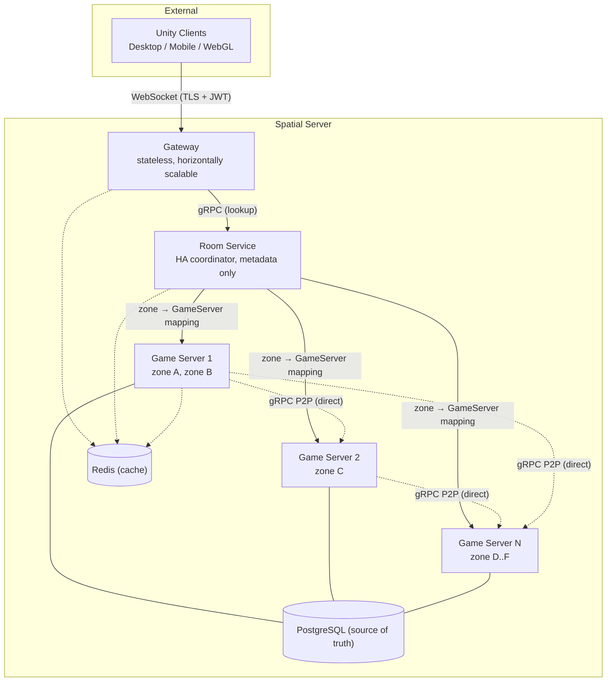

# Architecture Overview

> **Last Updated:** 2026-06-26

## Purpose

This document describes the system architecture of Spatial Server — a reusable distributed realtime platform for spatial applications.

## Scope

Spatial Server is a realtime infrastructure platform. It does **not** contain business logic. Business logic belongs to external Business Backend applications.

## Architecture Diagram

**Style:** Hybrid — Lightweight Coordinator + Direct P2P RPC

## Architecture Principles

1. **Production First** — Architecture designed for final production topology from day one.
2. **Horizontal Scaling First** — Prefer adding instances over increasing CPU/RAM.
3. **Logical Service Independence** — Service definition independent from physical deployment.
4. **Infrastructure as Code** — Everything reproducible from source.
5. **Cloud Agnostic** — No business logic depends on a specific cloud provider.
6. **Clean Separation** — Spatial Server = realtime infrastructure. Business Backend = business logic.

## Platform Boundary

### Business Backend Owns
- Authentication (issues JWT tokens)
- User management, organizations
- Room/showroom/meeting metadata
- Access control, permissions
- REST API, admin dashboard

### Spatial Server Owns
- Runtime instance lifecycle
- Zone ownership and Game Server allocation
- AOI and entity replication
- Player presence and movement
- Real-time synchronization

## Component Responsibilities

| Service | Role | State |
|---------|------|-------|
| **Gateway** | WebSocket termination (nhooyr.io), client auth, rate limiting, connection routing | Stateless |
| **Room Service** | Zone ownership table, load balancing, service discovery, HA coordination | Lightweight metadata |
| **Game Server** | Entity simulation, AOI queries (in-memory), state persistence, client state replication | Zone state |
| **PostgreSQL** | Runtime metadata, zone ownership records, Game Server registry | Source of truth (operational only) |
| **Redis** | Session cache, metadata cache, pub/sub for non-realtime domain events | Cache layer |

## Technology Stack

| Layer | Technology |
|-------|-----------|
| Language | Go |
| Transport | WebSocket (nhooyr.io) |
| Internal RPC | gRPC / Protobuf |
| Database | PostgreSQL (pgx) |
| Cache | Redis (go-redis) |
| Configuration | koanf |
| Logging | slog |
| Monitoring | Prometheus + Grafana |
| Logging Backend | Loki |
| Tracing | OpenTelemetry |
| Container Runtime | Docker |
| Orchestrator | K3s (production), Docker Compose (dev) |
| Infrastructure | Terraform + cloud-init |
| Package Manager | Helm |
| CI/CD | GitHub Actions |

## Design Decisions

- **Grid-based zones** over spatial hash for simplicity and deterministic ownership.
- **Direct gRPC P2P** over central router to avoid bottleneck and reduce latency.
- **Coordinator (Room Service)** over gossip protocol for simplicity at initial scale.
- **PostgreSQL** for operational metadata (not gameplay state) to leverage transactions for ownership guarantees.

## References

- [Architecture Principles](principles.md)
- [System Context](system-context.md)
- [Communication Patterns](communication.md)
- [Communication Matrix](communication-matrix.md)
- [Service Boundaries](service-boundaries.md)
- [Runtime Model](runtime-model.md)
- [Runtime Lifecycle](runtime-lifecycle.md)
- [Scaling Strategy](scaling.md)
- [Performance Budget](performance-budget.md)
- [Component Responsibilities](component-responsibilities.md)
- [AOI Architecture](aoi-architecture.md)
- [Data Model](data-model.md)
- [Deployment Topology](deployment-topology.md)
- [Repository Structure](repository-structure.md)
- [ADR-001](../adr/001-zone-ownership.md) — Zone Ownership
- [ADR-004](../adr/004-coordinator.md) — Coordinator Pattern
- [ADR-013](../adr/013-platform-boundary.md) — Platform Boundary
- [ADR-015](../adr/015-architecture-principles.md) — Architecture Principles
- [Component Diagram](../diagrams/component.md)
- [Sequence Diagrams](../diagrams/sequences.md)
