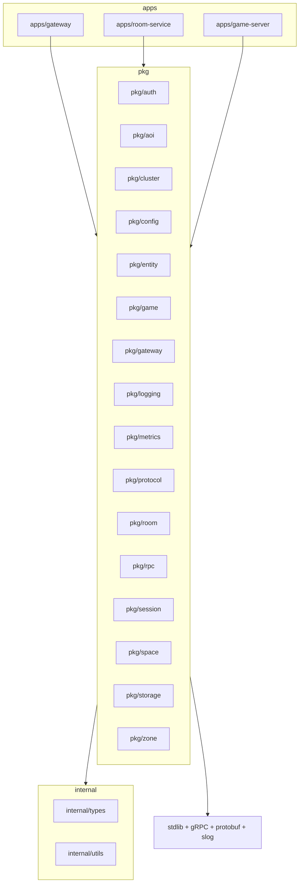

# Repository Structure

> **Last Updated:** 2026-06-26

## Purpose

Document the directory structure and responsibility of each directory in the spatial-server repository.

## Repository Root

```
spatial-server/
├── apps/                    # Service binaries (entry points)
│   ├── gateway/                 # WebSocket termination, JWT auth, rate limiting
│   ├── room-service/            # Zone ownership, runtime lifecycle, coordination
│   └── game-server/             # Simulation loop, entity management, AOI
├── pkg/                     # Shared libraries
│   ├── auth/                    # JWT generation and validation
│   ├── aoi/                     # Area of Interest (grid-based)
│   ├── cluster/                 # Cluster membership, service discovery
│   ├── config/                  # Configuration loading (koanf)
│   ├── entity/                  # Entity model and components
│   ├── game/                    # Game loop core
│   ├── gateway/                 # Gateway server, handler, rate limiter
│   ├── logging/                 # Structured logging (slog)
│   ├── metrics/                 # Prometheus metric registration
│   ├── protocol/                # Binary packet protocol
│   ├── room/                    # Room Service core logic
│   ├── rpc/                     # gRPC helpers
│   ├── session/                 # Session management
│   ├── space/                   # Space/Room model
│   ├── storage/                 # PostgreSQL, Redis connections + migrations
│   └── zone/                    # Zone management
├── internal/                # Internal shared types and utilities
│   ├── types/                   # Shared Go types
│   ├── utils/                   # Shared utilities
│   └── migration/               # Database migration runner
├── proto/                   # gRPC protobuf definitions
│   ├── common.proto
│   ├── gateway.proto
│   ├── room_service.proto
│   └── game_server.proto
├── gen/                     # Generated protobuf code
├── configs/                 # YAML configuration files per service
│   ├── defaults.yml
│   ├── gateway.yml
│   ├── room-service.yml
│   └── game-server.yml
├── build/                   # Build system
│   └── docker/                  # Dockerfiles per service
├── deploy/                  # Docker Compose (local dev only)
│   └── docker-compose/
├── infra/                   # Terraform, Helm, cloud-init
│   ├── terraform/
│   │   ├── providers/
│   │   ├── modules/
│   │   └── environments/
│   ├── helm/
│   │   ├── gateway/
│   │   ├── room-service/
│   │   ├── game-server/
│   │   ├── redis/
│   │   ├── postgres/
│   │   └── monitoring/
│   ├── cloud-init/
│   │   ├── gateway/
│   │   ├── room-service/
│   │   └── game-server/
│   └── scripts/
├── scripts/                 # Development and ops scripts
│   ├── dev-up.sh
│   ├── dev-down.sh
│   ├── seed-db.sh
│   └── migrate.sh
├── test/                    # Integration, load, chaos tests
│   ├── integration/
│   ├── load/
│   └── chaos/
├── docs/                    # Documentation
├── benchmarks/              # Benchmark reports
├── .github/                 # GitHub Actions CI/CD
├── go.mod / go.sum
├── Makefile
└── README.md
```

## Directory Responsibility Table

| Directory | Responsibility |
|-----------|----------------|
| `apps/` | Service binaries — thin `main.go` entry points that wire dependencies and start each service. |
| `apps/gateway/` | Gateway binary: WebSocket termination (nhooyr.io), JWT auth, rate limiting, connection routing. |
| `apps/room-service/` | Room Service binary: zone ownership table, load balancing, service discovery, HA coordination. |
| `apps/game-server/` | Game Server binary: entity simulation, AOI queries, state persistence, client replication. |
| `pkg/` | Shared libraries reusable across services. |
| `pkg/auth/` | JWT generation and validation. |
| `pkg/aoi/` | Area of Interest grid-based spatial index (in-memory). |
| `pkg/cluster/` | Cluster membership, service discovery, peer management. |
| `pkg/config/` | Configuration loading via koanf (YAML + env + CLI). |
| `pkg/entity/` | Entity model: position, attributes, components, ID generation. |
| `pkg/game/` | Game Server core loop: simulation tick, entity lifecycle. |
| `pkg/gateway/` | Gateway logic: connection management, client routing, rate limiter. |
| `pkg/logging/` | Structured logging via slog (JSON production, console dev). |
| `pkg/metrics/` | Prometheus metric registration and exposition. |
| `pkg/protocol/` | Binary packet protocol: message types, encoding/decoding, packet definitions. |
| `pkg/room/` | Room Service logic: zone ownership CRUD, heartbeat handling, load balancing. |
| `pkg/rpc/` | gRPC client/server helpers, interceptors, connection pooling. |
| `pkg/session/` | Session management, reconnection tokens, state recovery. |
| `pkg/space/` | Space/Room model: runtime definition, zone composition. |
| `pkg/storage/` | PostgreSQL (pgx) and Redis (go-redis) connection pools, repositories, transactions. NOT migration runner. |
| `pkg/zone/` | Zone management: grid cell operations, boundary calculations. |
| `internal/` | Internal shared types and utilities not importable outside the module. |
| `internal/types/` | Shared Go types used across packages. |
| `internal/utils/` | Shared utility functions. |
| `internal/migration/` | Database migration runner (golang-migrate). |
| `proto/` | gRPC protobuf definition files (.proto). |
| `gen/` | Generated protobuf Go code. |
| `configs/` | YAML configuration files per service and shared defaults. |
| `build/` | Build artifacts: Dockerfiles for each service, base image configs. |
| `deploy/` | Docker Compose for local dev. |
| `infra/` | Infrastructure as Code: Terraform, Helm charts, cloud-init scripts. |
| `infra/terraform/` | Terraform providers, modules, environment configurations. |
| `infra/helm/` | Helm charts for gateway, room-service, game-server, redis, postgres, monitoring. |
| `infra/cloud-init/` | cloud-init bootstrap scripts per service type. |
| `scripts/` | Developer and ops shell scripts (dev-up, dev-down, seed, migrate). |
| `test/` | Test suites beyond unit tests. |
| `test/integration/` | Integration tests with PostgreSQL/Redis via Testcontainers. |
| `test/load/` | Load tests (k6 + custom WebSocket clients). |
| `test/chaos/` | Chaos tests for network partitions, crash recovery. |
| `docs/` | Architecture, ADRs, deployment, operations, protocol documentation. |
| `benchmarks/` | Benchmark reports and performance regression data. |
| `.github/` | GitHub Actions CI/CD workflows. |

## Dependency Rules

```
apps/* → pkg/* → internal/* (never the reverse)
pkg/* → standard library, gRPC, protobuf, slog
No package in pkg/ depends on apps/*
```

- `apps/` imports any `pkg/` and `internal/` package.
- `pkg/` depends only on the standard library, Google gRPC, protobuf, and slog.
- `pkg/` never depends on `apps/` or HTTP frameworks (except in dedicated adapter packages).
- Infrastructure abstractions live in `pkg/storage/` (connection pools only).
- Migration runner lives in `internal/migration/` (not in `pkg/storage/`).

### Per-Package Dependency Rules

| Package | Allowed Dependencies |
|---------|---------------------|
| `apps/*` | all `pkg/*`, google gRPC, slog, koanf |
| `pkg/entity/` | `internal/types/`, standard library only |
| `pkg/aoi/` | `internal/types/`, standard library only (in-memory index) |
| `pkg/storage/` | pgx, go-redis, standard library |
| `internal/migration/` | golang-migrate, pgx, standard library |
| `pkg/gateway/` | nhooyr.io/websocket, pkg/protocol, pkg/auth |
| `pkg/room/` | google gRPC, pkg/cluster, pgx |
| `pkg/game/` | google gRPC, pkg/entity, pkg/space, pkg/aoi, pkg/protocol |

## Dependency Direction Diagram



## Layer Rules

```
apps/          → all pkg/, google gRPC, slog, koanf
pkg/entity/    → internal/types/, standard library only
pkg/aoi/       → internal/types/, standard library only (in-memory index)
pkg/storage/   → pgx, go-redis, standard library
pkg/gateway/   → nhooyr.io/websocket, pkg/protocol, pkg/auth
pkg/room/      → google gRPC, pkg/cluster, pgx
pkg/game/      → google gRPC, pkg/entity, pkg/space, pkg/aoi, pkg/protocol
```

## References

- [ADR-015](../adr/015-architecture-principles.md) — Architecture Principles
- [Standards: Dependency Rules](../standards/dependency-rules.md)
- [Standards: Coding](../standards/coding.md)
