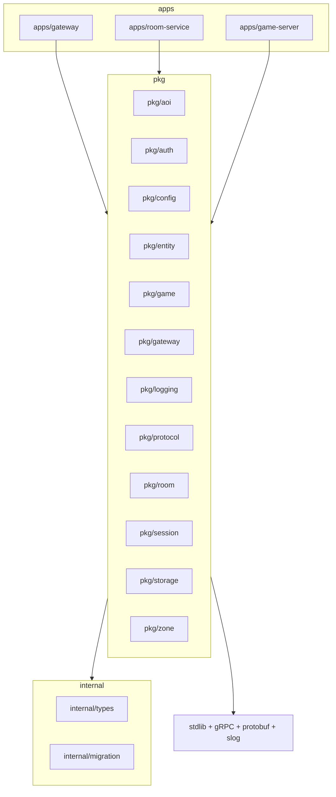

# Repository Structure

> **Last Updated:** 2026-06-27

## Purpose

Document the directory structure and responsibility of each directory in the spatial-server repository. This reflects the **actual** on-disk layout (module `github.com/thaolaptrinh/spatial-server`).

## Repository Root

```
spatial-server/
├── apps/                    # Service binaries (entry points)
│   ├── gateway/                 # WebSocket termination, JWT auth, client relay
│   ├── room-service/            # Room Service gRPC server: registry, lookup, transfer
│   └── game-server/             # Game Server gRPC server: simulation, AOI, relay
├── pkg/                     # Shared libraries
│   ├── aoi/                     # Area of Interest (grid-based, in-memory index)
│   ├── auth/                    # JWT validation (golang-jwt)
│   ├── config/                  # Configuration loading (koanf)
│   ├── entity/                  # Entity model and lifecycle
│   ├── game/                    # Game loop core (tick, simulation)
│   ├── gateway/                 # Gateway server, handler, router cache, relay
│   ├── logging/                 # Structured logging (slog)
│   ├── protocol/                # Binary packet protocol (framing, compression)
│   ├── room/                    # Room Service in-memory registry & lookup logic
│   ├── session/                 # Connection / session pool
│   ├── storage/                 # PostgreSQL (pgx) + Redis (go-redis) connection pools
│   │   └── migrations/              # SQL migrations (golang-migrate format)
│   └── zone/                    # Zone model and grid operations
├── internal/                # Private types and utilities (not importable outside module)
│   ├── migration/               # Database migration runner (golang-migrate)
│   └── types/                   # Shared Go types (IDs, Vector3, statuses, sentinel errors)
├── proto/                   # gRPC protobuf definitions and generated code
│   ├── spatialserver/v1/        # .proto sources (package spatialserver.v1)
│   │   ├── common.proto
│   │   ├── spatial_server_api.proto
│   │   ├── room_service.proto
│   │   ├── game_server.proto
│   │   └── gateway.proto        # Empty placeholder service (unused)
│   └── gen/spatialserver/v1/    # Generated Go code (*.pb.go, *_grpc.pb.go)
├── configs/                 # YAML configuration files per service
│   ├── defaults.yml
│   ├── gateway.yml
│   ├── room-service.yml
│   └── game-server.yml
├── build/                   # Build assets
│   └── docker/                  # Dockerfile per service
├── deploy/                  # Local development deployment only
│   └── docker-compose/          # docker-compose.yml
├── scripts/                 # Development shell scripts
│   ├── dev-up.sh
│   └── dev-down.sh
├── test/                    # Non-unit tests
│   └── integration/             # Integration tests (realtime flow)
├── tools/                   # Standalone tools
│   └── client/                  # WebSocket test client
├── docs/                    # Documentation (architecture, ADRs, standards, ops, testing)
├── .github/                 # GitHub Actions CI/CD
├── go.mod / go.sum
├── Makefile
└── README.md
```

## Directory Responsibility Table

| Directory | Responsibility |
|-----------|----------------|
| `apps/` | Service binaries — thin `main.go` entry points that wire dependencies and start each service. |
| `apps/gateway/` | Gateway binary: WebSocket termination (`coder/websocket`), JWT validation, client relay via `GameServer.Relay`. |
| `apps/room-service/` | Room Service binary: Game Server registry, `LookupZone`/`LookupServer`, `Register`/`Heartbeat`, zone transfer coordination. |
| `apps/game-server/` | Game Server binary: entity simulation, AOI queries, zone state, client relay stream. |
| `pkg/` | Shared libraries reusable across services. |
| `pkg/aoi/` | Grid-based in-memory Area of Interest spatial index. |
| `pkg/auth/` | JWT validation (HMAC, golang-jwt). |
| `pkg/config/` | Configuration loading via koanf (YAML + env). |
| `pkg/entity/` | Entity model, attributes (`map[string][]byte`), lifecycle interface. |
| `pkg/game/` | Game Server core loop: tick simulation, entity state, command inbox. |
| `pkg/gateway/` | Gateway logic: HTTP/WS handler, router cache (zone → Game Server), relay. |
| `pkg/logging/` | Structured logging via slog (JSON production, console dev) + context helpers. |
| `pkg/protocol/` | Binary packet protocol: length-prefixed framing, gzip compression, packet IDs. |
| `pkg/room/` | Room Service logic: in-memory `ServerRegistry`, heartbeat tracking. |
| `pkg/session/` | Per-connection session state and session pool. |
| `pkg/storage/` | PostgreSQL (pgx) and Redis (go-redis) connection pool factories. Migrations live under `pkg/storage/migrations/` (SQL files only). |
| `pkg/zone/` | Zone model: ID, grid coord, size, status; grid operations. |
| `internal/` | Internal types and utilities not importable outside the module. |
| `internal/types/` | Shared Go types: `EntityID`, `ZoneID`, `RuntimeID`, `ServerID`, `Vector3`, status enums, sentinel errors. |
| `internal/migration/` | Database migration runner (golang-migrate). The runner; SQL files are in `pkg/storage/migrations/`. |
| `proto/spatialserver/v1/` | gRPC protobuf definition files (`.proto`), package `spatialserver.v1`. |
| `proto/gen/spatialserver/v1/` | Generated Go bindings (`*.pb.go`, `*_grpc.pb.go`). Produced via `make proto`. |
| `configs/` | YAML configuration files per service and shared defaults. |
| `build/docker/` | Per-service Dockerfiles (`gateway`, `room-service`, `game-server`). |
| `deploy/docker-compose/` | Docker Compose for local development. |
| `scripts/` | Developer shell scripts (`dev-up.sh`, `dev-down.sh`). |
| `test/integration/` | Integration tests beyond unit tests. |
| `tools/client/` | Standalone WebSocket test client. |
| `docs/` | Architecture, ADRs, standards, ops, testing, protocol documentation. |
| `.github/` | GitHub Actions CI/CD workflows. |

## Planned / Future Directories (Not Yet Present)

These are referenced in ADRs / docs as future work but do **not** exist in the repository yet:

| Directory | Purpose | Reference |
|-----------|---------|-----------|
| `infra/` | Infrastructure as Code: Terraform, Helm charts, cloud-init | [ADR-008](../adr/008-deployment.md), [ADR-014](../adr/014-infrastructure-platform.md) |
| `pkg/metrics/` | Prometheus metric registration and exposition | [ADR-019](../adr/019-observability.md) |
| `test/load/` | Load tests (k6 + WebSocket clients) | [ADR-020](../adr/020-benchmark-strategy.md) |
| `test/chaos/` | Chaos tests (network partitions, crash recovery) | [ADR-020](../adr/020-benchmark-strategy.md) |

## Dependency Rules

```
apps/* → pkg/* → internal/* (never the reverse)
pkg/* → standard library, gRPC, protobuf, slog
No package in pkg/ depends on apps/*
```

- `apps/` imports any `pkg/` and `internal/` package.
- `pkg/` depends only on the standard library, Google gRPC, protobuf, slog, and small focused third-party libs (koanf, pgx, go-redis, golang-jwt, coder/websocket).
- `pkg/` never depends on `apps/`.
- Infrastructure abstractions live in `pkg/storage/` (connection pools only).
- Migration runner lives in `internal/migration/`; SQL files live in `pkg/storage/migrations/`.

### Per-Package Dependency Rules

Derived from actual imports:

| Package | Allowed Dependencies |
|---------|---------------------|
| `apps/*` | all `pkg/*`, all `internal/*`, koanf, google gRPC, slog, generated proto (`proto/gen/...`) |
| `pkg/entity/` | `internal/types/`, standard library only |
| `pkg/aoi/` | `internal/types/`, standard library only |
| `pkg/zone/` | `internal/types/`, standard library only |
| `pkg/protocol/` | standard library only (no internal/types) |
| `pkg/session/` | `internal/types/`, standard library only |
| `pkg/auth/` | `golang-jwt/jwt/v5`, standard library only |
| `pkg/config/` | `koanf`, standard library only |
| `pkg/logging/` | `log/slog`, standard library only |
| `pkg/storage/` | `pgx`, `go-redis`, standard library |
| `pkg/gateway/` | `coder/websocket`, google gRPC, `pkg/auth`, `pkg/session`, `internal/types/`, generated proto |
| `pkg/room/` | `internal/types/`, standard library only |
| `pkg/game/` | `pkg/aoi`, `pkg/entity`, `pkg/protocol`, `pkg/zone`, `internal/types/`, google protobuf, generated proto |
| `internal/types/` | standard library only |
| `internal/migration/` | `golang-migrate`, `pgx`, standard library |

## Dependency Direction Diagram



## Layer Rules

```
apps/            → all pkg/, all internal/, koanf, gRPC, slog, generated proto
pkg/entity/      → internal/types/, standard library only
pkg/aoi/         → internal/types/, standard library only
pkg/zone/        → internal/types/, standard library only
pkg/protocol/    → standard library only
pkg/storage/     → pgx, go-redis, standard library
pkg/gateway/     → coder/websocket, gRPC, pkg/auth, pkg/session, internal/types/, generated proto
pkg/game/        → pkg/aoi, pkg/entity, pkg/protocol, pkg/zone, internal/types/, generated proto
pkg/room/        → internal/types/, standard library only
internal/        → standard library only (internal/migration/ also uses golang-migrate + pgx)
```

## References

- [ADR-015](../adr/015-architecture-principles.md) — Architecture Principles
- [Standards: Dependency Rules](../standards/dependency-rules.md)
- [Standards: Coding](../standards/coding.md)
