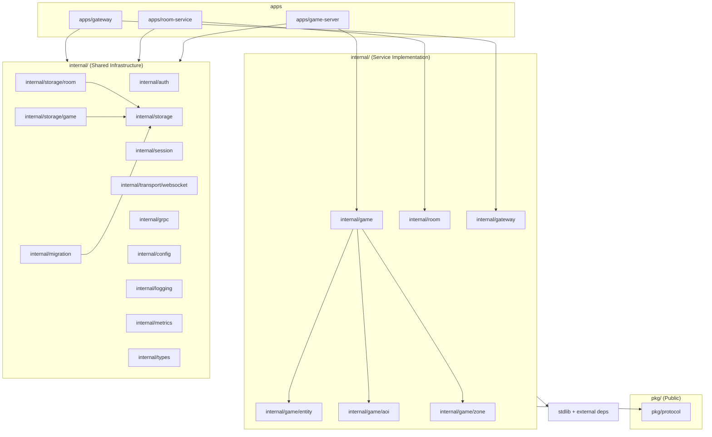

# Repository Structure

> **Last Updated:** 2026-06-27

## Purpose

Document the directory structure and responsibility of each directory in the spatial-server repository. This reflects the **actual** on-disk layout after the Modular Monolith refactor (module `github.com/thaolaptrinh/spatial-server`).

## Repository Root

```
spatial-server/
├── apps/                         # Service binaries (entry points)
│   ├── gateway/                      # Gateway binary: WebSocket termination, JWT auth, client relay
│   ├── room-service/                 # Room Service binary: registry, lookup, transfer
│   └── game-server/                  # Game Server binary: simulation, AOI, relay
├── internal/                     # Service implementation + shared infrastructure
│   │
│   │  # ── Service Implementation ──
│   ├── gateway/                      # Gateway: HTTP handler, WebSocket relay, router cache
│   ├── room/                         # Room Service: server registry, zone ownership, SpatialServerAPI
│   ├── game/                         # Game Server: simulation loop, NPC AI, entity, AOI, zone
│   │   ├── entity/                       # Entity model and lifecycle
│   │   ├── aoi/                          # Grid-based spatial index (area of interest)
│   │   └── zone/                         # Zone model and grid operations
│   │
│   │  # ── Shared Infrastructure ──
│   ├── auth/                         # JWT validation (HMAC, golang-jwt) — cross-cutting
│   ├── session/                      # Session pool and lifecycle — cross-cutting
│   ├── transport/
│   │   └── websocket/                # WebSocket abstraction (Connection + Accepter interfaces)
│   │       └── coder/                    # coder/websocket implementation
│   ├── storage/                      # Database: connection pools, migrations, domain repos
│   │   ├── migrations/                   # SQL migrations (golang-migrate format)
│   │   ├── room/                         # Room domain persistence (ServerRepository, ZoneRepository)
│   │   └── game/                         # Game domain persistence (SnapshotStore)
│   ├── grpc/                         # gRPC interceptors (recovery, logging, metrics)
│   ├── config/                       # Configuration loading (koanf: YAML + env)
│   ├── logging/                      # Structured logging setup (slog)
│   ├── metrics/                      # Prometheus metric registration + /metrics handler
│   ├── types/                        # Shared Go types (IDs, Vector3, status, sentinel errors)
│   └── migration/                    # Database migration runner (golang-migrate)
│
├── pkg/
│   └── protocol/                  # Binary packet protocol (ONLY pkg/ — external reuse)
├── proto/                        # gRPC protobuf definitions and generated code
│   ├── spatialserver/v1/             # .proto sources (package spatialserver.v1)
│   └── gen/spatialserver/v1/         # Generated Go code (*.pb.go, *_grpc.pb.go)
├── configs/                      # YAML configuration per service
├── build/docker/                 # Dockerfiles
├── deploy/docker-compose/        # Local dev Docker Compose
├── scripts/                      # dev-up.sh, dev-down.sh
├── tests/integration/            # Integration tests (realtime flow)
├── tests/chaos/                  # Chaos tests (scripted)
├── tests/fuzz/                   # Fuzz tests
├── tests/security/               # Security tests
├── tools/client/                 # WebSocket test CLI
├── docs/                         # Architecture, ADRs, standards, ops, testing
├── go.mod / go.sum
├── Makefile
└── README.md
```

## Directory Responsibility Table

| Directory | Responsibility |
|-----------|----------------|
| `apps/gateway/` | Gateway binary: WebSocket termination, JWT validation, client relay via `GameServer.Relay`. |
| `apps/room-service/` | Room Service binary: Game Server registry, `LookupZone`/`LookupServer`, `Register`/`Heartbeat`, zone transfer coordination. |
| `apps/game-server/` | Game Server binary: entity simulation, AOI queries, zone state, client relay stream. |
| **Service Implementation** | |
| `internal/gateway/` | Gateway logic: HTTP handler (health/live/ready/ws), WebSocket relay, router cache (zone → Game Server). |
| `internal/room/` | Room Service logic: `ServerRegistry`, zone ownership tracking, `SpatialServerAPI` gRPC implementation. |
| `internal/game/` | Game Server core loop: tick simulation, NPC behaviors, entity codec. |
| `internal/game/entity/` | Entity model: `EntityID`, attributes (`map[string][]byte`), lifecycle interface. |
| `internal/game/aoi/` | Grid-based in-memory spatial index for area-of-interest queries. |
| `internal/game/zone/` | Zone model: ID, grid coord, size, status; grid operations. |
| **Shared Infrastructure** | |
| `internal/auth/` | JWT validation (HMAC, golang-jwt) — cross-cutting, not service-owned. |
| `internal/session/` | Per-connection session state and session pool — cross-cutting, not service-owned. |
| `internal/transport/websocket/` | WebSocket abstraction layer: `Connection` + `Accepter` interfaces for transport independence. |
| `internal/transport/websocket/coder/` | `coder/websocket` implementation of transport interfaces. |
| `internal/storage/` | PostgreSQL (pgx) and Redis (go-redis) connection pool factories. Migrations. |
| `internal/storage/room/` | Room domain persistence: `ServerRepository`, `ZoneRepository` (pgx-backed). |
| `internal/storage/game/` | Game domain persistence: `SnapshotStore` for zone state snapshots. |
| `internal/grpc/` | gRPC interceptors: recovery, logging, metrics (shared across all gRPC servers). |
| `internal/config/` | Configuration loading via koanf (YAML + env). Unified Config struct. |
| `internal/logging/` | Structured logging setup via slog (JSON production, console dev). |
| `internal/metrics/` | Prometheus metric registry, handler for `/metrics`. |
| `internal/types/` | Shared Go types: `EntityID`, `ZoneID`, `RuntimeID`, `ServerID`, `Vector3`, status enums, sentinel errors. |
| `internal/migration/` | Database migration runner (golang-migrate). |
| **Public Libraries** | |
| `pkg/protocol/` | Binary packet protocol: length-prefixed framing, gzip compression, packet IDs. Only package in `pkg/`. |
| **Proto** | |
| `proto/spatialserver/v1/` | gRPC protobuf definition files (`.proto`), package `spatialserver.v1`. |
| `proto/gen/spatialserver/v1/` | Generated Go bindings (`*.pb.go`, `*_grpc.pb.go`). Produced via `make proto`. |

## Planned / Future Directories (Not Yet Present)

| Directory | Purpose | Reference |
|-----------|---------|-----------|
| `infra/` | Infrastructure as Code: Terraform, Helm charts, cloud-init | [ADR-008](../adr/008-deployment.md), [ADR-014](../adr/014-infrastructure-platform.md) |
| `tests/load/` | Load tests (k6 + WebSocket clients) | [ADR-020](../adr/020-benchmark-strategy.md) |

## Dependency Rules

```
apps/* → internal/* → standard library + external deps
apps/* → pkg/protocol/
NO cross-service imports (internal/gateway/ must not import internal/room/ or internal/game/)
```

**Service Boundary Law:**

- A service may depend on: shared contracts (proto/gen/), shared infrastructure, shared transport.
- A service must NEVER depend on: another service's implementation, another service's domain types.
- Cross-service communication occurs ONLY through gRPC + Protocol Buffers.

### Per-Package Dependency Rules

| Package | Allowed Dependencies |
|---------|---------------------|
| `apps/*` | all `internal/*`, `pkg/protocol`, koanf, google gRPC, slog |
| `internal/game/entity/` | `internal/types/`, standard library only |
| `internal/game/aoi/` | `internal/types/`, standard library only |
| `internal/game/zone/` | `internal/types/`, standard library only |
| `internal/game/` | `internal/game/{entity,aoi,zone}`, `internal/types/`, `pkg/protocol`, google protobuf, proto gen |
| `internal/gateway/` | `internal/transport/websocket/`, `internal/auth`, `internal/session`, `internal/types/`, proto gen |
| `internal/room/` | `internal/types/`, proto gen |
| `internal/auth/` | `golang-jwt/jwt/v5`, standard library |
| `internal/session/` | `internal/types/`, standard library |
| `internal/transport/websocket/` | standard library |
| `internal/transport/websocket/coder/` | `coder/websocket`, `internal/transport/websocket/` |
| `internal/storage/` | `pgx`, `go-redis`, `internal/migration/`, standard library |
| `internal/storage/room/` | `pgx`, `internal/room/`, `internal/storage/`, `internal/types/` |
| `internal/storage/game/` | `pgx`, standard library |
| `internal/grpc/` | `google.golang.org/grpc`, `internal/logging/`, `internal/metrics/`, standard library |
| `internal/config/` | `koanf`, standard library |
| `internal/logging/` | `log/slog`, standard library |
| `internal/metrics/` | `prometheus/client_golang`, standard library |
| `internal/types/` | standard library only |
| `internal/migration/` | `golang-migrate`, `pgx`, standard library |
| `pkg/protocol/` | `google.golang.org/protobuf/proto`, standard library |

## Dependency Direction Diagram



## References

- [ADR-015](../adr/015-architecture-principles.md) — Architecture Principles
- [Standards: Dependency Rules](../standards/dependency-rules.md)
- [Standards: Coding](../standards/coding.md)
- [Modular Monolith Refactor Spec](../superpowers/specs/2026-06-27-modular-monolith-refactor.md)
