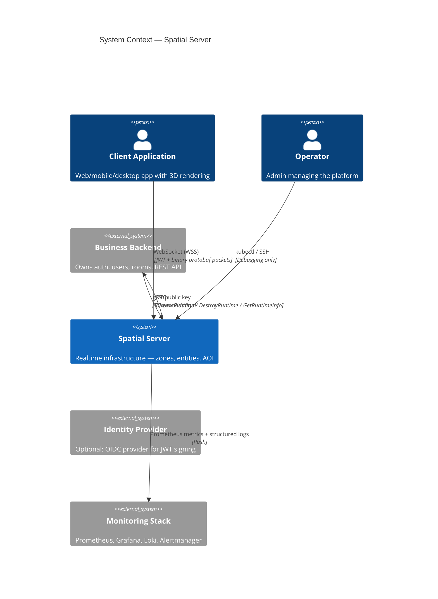

# System Context

> **Last Updated:** 2026-06-26

## Purpose

Describes how Spatial Server fits into the larger ecosystem — the external actors it interacts with and the boundaries between them.

## System Context Diagram



## Actors

### Client Application

The end-user's application (web, mobile, desktop) that renders the 3D world and connects to Spatial Server for realtime synchronization. Clients authenticate with the Business Backend first, receive a JWT runtime token, then connect to Spatial Server via WebSocket.

### Business Backend

The external application that owns all business logic — user management, room/showroom/meeting metadata, access control, and the REST/admin API. Spatial Server is infrastructure only. The Business Backend:

- Issues JWT runtime tokens (signed with its own private key)
- Calls `CreateRuntime` / `DestroyRuntime` to manage runtime lifecycles
- Provides its public key for Gateway token validation
- Is **never** called synchronously during gameplay (no hot-path dependency)

### Operator

Platform administrator who deploys, monitors, and debugs Spatial Server infrastructure. Operators interact via `kubectl` (K3s), Grafana dashboards, and SSH (debugging only — never for configuration).

### Identity Provider (Optional)

An external OIDC provider (e.g., Auth0, Keycloak) that the Business Backend may use for user authentication. Spatial Server has no direct dependency on the IdP — only the Business Backend does.

### Monitoring Stack

Prometheus scrapes `/metrics` endpoints from all services. Promtail collects structured JSON logs and ships them to Loki. Grafana provides dashboards. Alertmanager handles notification routing.

## Data Flow Summary

```
Client Auth:     Client ──auth──▶ Business Backend ──JWT──▶ Client
Runtime Create:  Business Backend ──gRPC──▶ Spatial Server ──gateway_addr──▶ Business Backend
Gameplay:        Client ──WebSocket──▶ Gateway ──gRPC──▶ Game Server
Telemetry:       Spatial Server ──metrics/logs──▶ Monitoring Stack
```

## Key Architectural Properties

- **No hot-path dependency on Business Backend** — gameplay continues if Business Backend is down
- **Spatial Server never calls Business Backend** — all communication is initiated by Business Backend
- **JWT is the trust boundary** — Gateway validates tokens using the Business Backend's public key
- **Monitoring is push-only** — services push metrics and logs; no external entity queries services

## References

- [ADR-013](../adr/013-platform-boundary.md) — Platform Boundary (defines what belongs where)
- [ADR-016](../adr/016-runtime-lifecycle.md) — Runtime Lifecycle
- [Overview](overview.md) — Component responsibilities table
