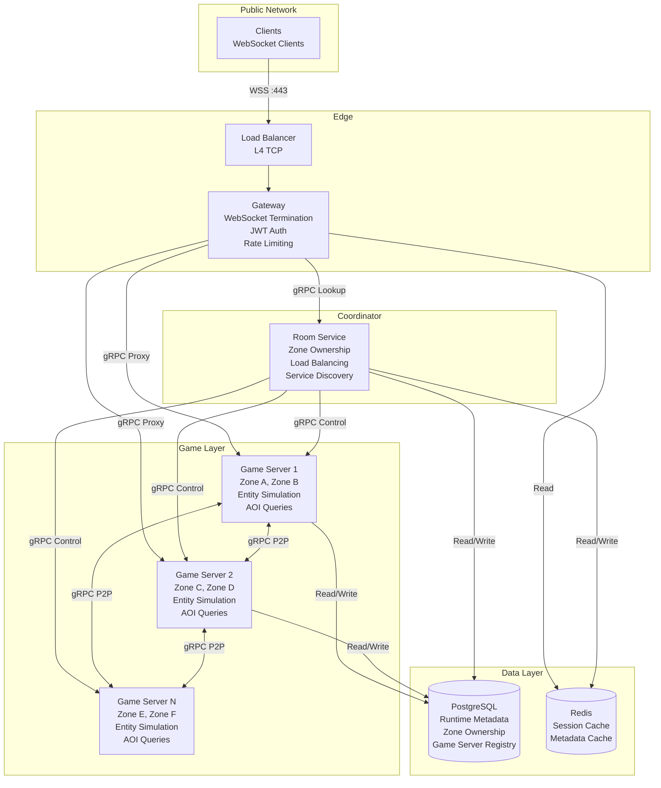

# Component Diagram

> **Last Updated:** 2026-06-26

## Purpose

Component-level view of Spatial Server's internal services (Gateway, Room Service, Game Servers) and data stores (PostgreSQL, Redis), showing responsibilities and the gRPC/read-write edges between them.

## Component Responsibilities

| Component | Responsibility |
|-----------|---------------|
| **Clients** | Connect via WebSocket. Send position updates, receive entity states. |
| **Load Balancer** | L4 TCP load balancing. Distributes WebSocket connections across Gateway instances. |
| **Gateway** | Terminates WebSocket connections. Validates JWT. Enforces rate limits. Routes packets to correct Game Server. |
| **Room Service** | Maintains zone ownership table. Registers Game Servers. Handles heartbeat monitoring. Reassigns zones on failure. |
| **Game Server** | Runs simulation loop. Manages entities. Processes AOI queries. Handles zone transfers. Replicates state to clients. |
| **PostgreSQL** | Stores runtime metadata, zone ownership records, Game Server registry. Source of truth for operational data. |
| **Redis** | Caches session data and metadata lookups. Pub/sub for non-realtime domain events. |

## References

- [Architecture Overview](../architecture/overview.md)
- [Sequence Diagrams](sequences.md)
