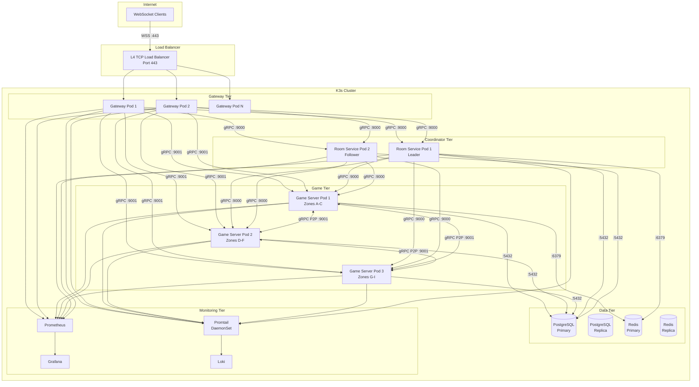

# Deployment Diagram

> **Last Updated:** 2026-06-26

## Production Topology (K3s)

## Kubernetes Resource Mapping

| Resource | Purpose |
|----------|---------|
| **Namespace** | `spatial-server` |
| **Deployment** | Gateway (stateless), Room Service (2 replicas), Game Server (N replicas) |
| **StatefulSet** | PostgreSQL, Redis |
| **Service** | ClusterIP for internal gRPC, LoadBalancer/NodePort for WebSocket |
| **ConfigMap** | Application configs |
| **Secret** | JWT public key, DB credentials, TLS certs |
| **Ingress** | WebSocket path routing to Gateway (with TLS termination) |
| **HPA** | Auto-scale Game Server (CPU > 70%, memory > 80%) |
| **PDB** | PodDisruptionBudget for Game Servers (min available: 1) |

## Capacity Planning

| Environment | Spec | Services per Node |
|-------------|------|--------------------|
| Stage 1 (Single VM) | 2 vCPU, 4 GB RAM | All services on one node |
| Stage 2 (Separate GS) | 4 vCPU, 8 GB RAM per GS node | Game Server only |
| Stage 3 (Separate DB) | 2 vCPU, 8 GB RAM per DB node | PostgreSQL + Redis |
| Stage 4 (K3s Cluster) | 4 vCPU, 8 GB RAM per worker | Per K3s worker node |

## Per-Service Capacity Limits

| Service | Limit | Constraint |
|---------|-------|-----------|
| Gateway | 10,000 concurrent connections | File descriptors + goroutines |
| Game Server | 5,000 entities (100/zone × 50 zones) | AOI query complexity O(n log n) |
| Room Service | 100 Game Servers registered | In-memory map + heartbeat processing |
| PostgreSQL | 50 concurrent connections | Pooled via pgx (max 20 per service) |

## References

- [Infrastructure Overview](../infrastructure/overview.md)
- [Deployment Guide](../operations/deployment.md)
- [ADR-008](../adr/008-deployment.md) — Deployment Strategy
- [ADR-017](../adr/017-capacity-planning.md) — Capacity Planning
