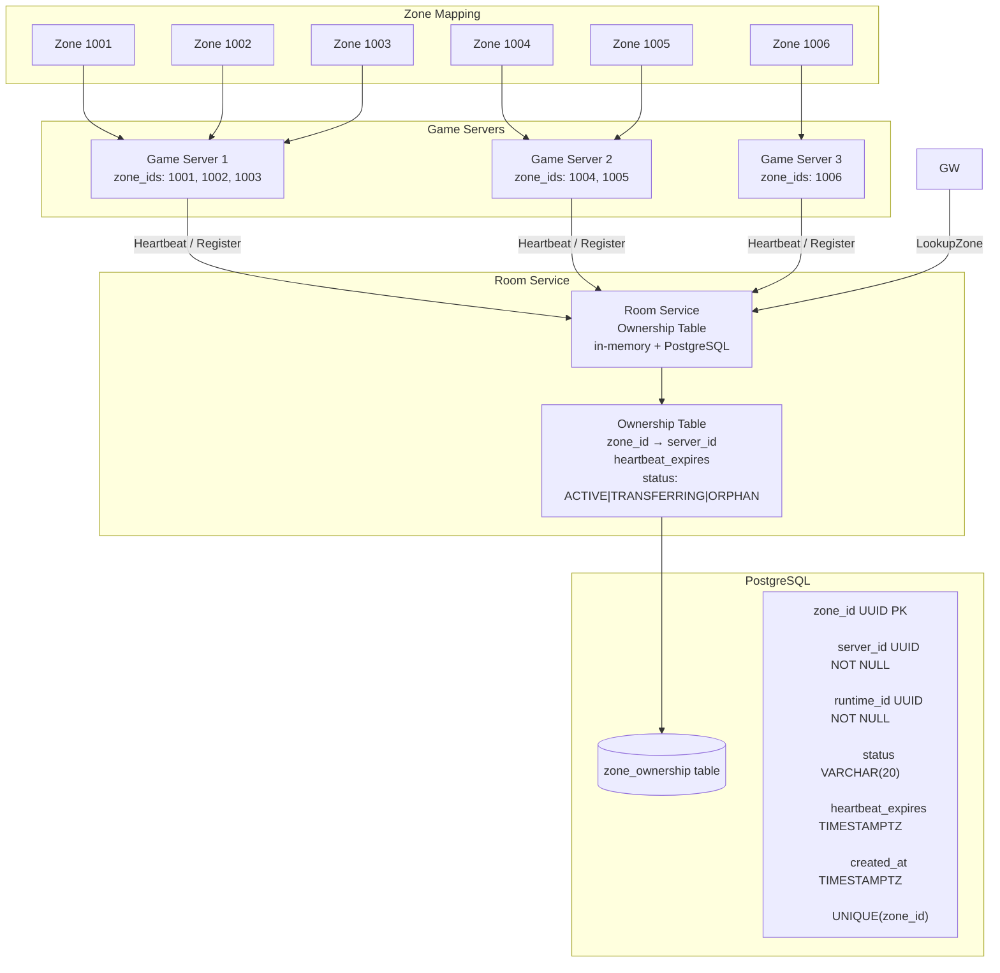
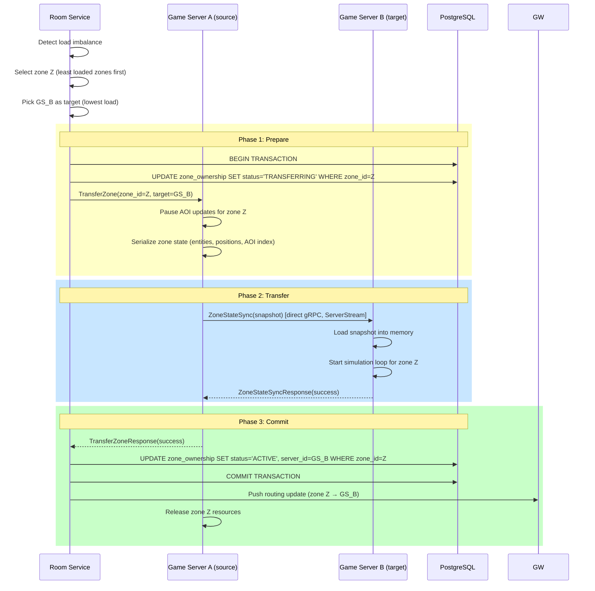
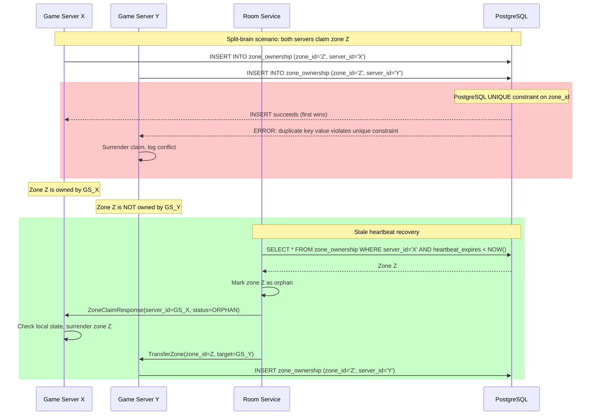

# Zone Ownership Diagram

> **Last Updated:** 2026-06-26

## Purpose

How zones are mapped to Game Servers, the ownership table that tracks zone→server assignments (in-memory + PostgreSQL), and the claim/transfer/release/conflict-resolution operations that keep ownership consistent.

## Zone Ownership Architecture

## Zone Transfer Sequence

## Conflict Resolution

## Ownership Operations

| Operation | Mechanism | PostgreSQL Statement |
|-----------|-----------|---------------------|
| **Claim zone** | Room Service assigns on CreateRuntime | `INSERT INTO zone_ownership (zone_id, server_id, status) VALUES ($1, $2, 'ACTIVE')` |
| **Transfer zone** | Two-phase prepare/commit | `UPDATE zone_ownership SET status='TRANSFERRING' WHERE zone_id=$1` → `UPDATE ... SET status='ACTIVE', server_id=$2` |
| **Release zone** | Room Service on DestroyRuntime | `DELETE FROM zone_ownership WHERE zone_id = $1` |
| **Recover orphan** | Heartbeat timeout detection | `UPDATE zone_ownership SET server_id=$1 WHERE heartbeat_expires < NOW() AND status != 'TRANSFERRING'` |
| **Conflict resolution** | PostgreSQL unique constraint | First INSERT wins, second gets error |

## References

- [ADR-001](../adr/001-zone-ownership.md) — Zone Ownership
- [ADR-002](../adr/002-zone-migration.md) — Zone Migration
- [ADR-011](../adr/011-failure-recovery.md) — Failure Recovery
- [Sequence Diagrams](sequences.md)
