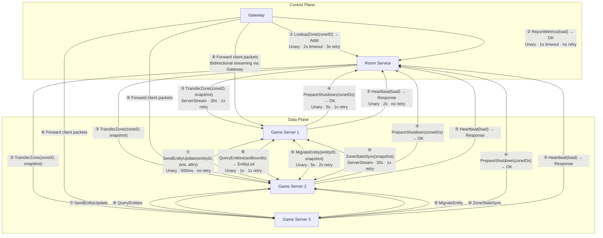
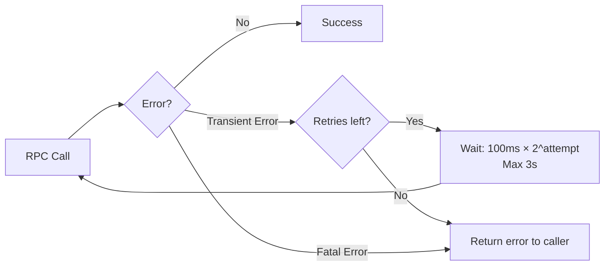

# RPC Communication Flow

> **Last Updated:** 2026-06-26

## RPC Architecture

## Full RPC Table

### Gateway → Room Service

| ID | RPC | Type | Timeout | Retry | Idempotent | Description |
|----|-----|------|---------|-------|------------|-------------|
| ① | `LookupZone(zoneID) → GameServerAddress` | Unary | 2s | 3x exponential backoff | Gateway resolves which Game Server owns a zone. Result cached for 5s TTL. |
| ② | `ReportMetrics(load, connections) → OK` | Unary | 1s | None (best effort) | Gateway reports its load metrics to Room Service for rebalancing decisions. |

### Room Service → Game Server

| ID | RPC | Type | Timeout | Retry | Idempotent | Description |
|----|-----|------|---------|-------|------------|-------------|
| ③ | `TransferZone(zoneID, targetID) → Status` | ServerStream | 30s | 1x | Yes | Room Service initiates zone transfer. ServerStream allows progress reporting. |

### Game Server → Room Service

| ID | RPC | Type | Timeout | Retry | Idempotent | Description |
|----|-----|------|---------|-------|------------|-------------|
| ④ | `PrepareShutdown(zoneIDs) → OK` | Unary | 5s | 1x | Yes | Game Server signals Room Service before shutting down. Room Service reassigns zones. |
| ⑤ | `Heartbeat(load) → HeartbeatResponse` | Unary | 2s | None | Yes | Game Server sends periodic heartbeat with load metrics. Missed 3+ triggers zone reassignment. |

### Gateway ↔ Game Server (Data Plane)

| ID | RPC | Type | Timeout | Retry | Idempotent | Description |
|----|-----|------|---------|-------|------------|-------------|
| ⑥ | Bidirectional packet relay | Bidirectional stream | Session TTL | N/A | N/A | Gateway forwards WebSocket packets to Game Server and relays responses back. Not a formal RPC—connection-oriented forwarding. |

### Game Server ↔ Game Server (Data Plane)

| ID | RPC | Type | Timeout | Retry | Idempotent | Description |
|----|-----|------|---------|-------|------------|-------------|
| ⑦ | `SendEntityUpdate(entityID, pos, attrs) → ACK` | Unary | 500ms | None (latest wins) | No | Real-time entity position broadcast between servers. Latest state supersedes previous—no retry needed. |
| ⑧ | `QueryEntities(aoiBounds) → EntityList` | Unary | 1s | 1x | Yes | AOI query across server boundaries. Returns entities within given bounds. |
| ⑨ | `MigrateEntity(entityID, snapshot) → OK` | Unary | 5s | 2x | Yes | Entity crosses zone boundary into another server's territory. Full state snapshot transferred. |
| ⑩ | `ZoneStateSync(snapshot) → Status` | ServerStream | 30s | 1x | Yes | Full zone state transfer during ownership change. Snapshot includes all entities, positions, AOI index. |

## Retry and Backoff Strategy

### Details

- **Base delay:** 100ms
- **Backoff factor:** 2× per attempt (100ms, 200ms, 400ms, ...)
- **Max delay:** 3s per individual wait
- **Max total:** Effectively bounded by RPC timeout
- **Jitter:** ±25% random jitter added to each wait to avoid thundering herd
- **No retry for:** `Heartbeat`, `ReportMetrics`, `SendEntityUpdate` (stale data is worse than no data)
- **Retry for:** `LookupZone` (transient DNS/cache miss), `TransferZone` (must succeed for consistency), `MigrateEntity` (must succeed for correctness)

## References

- [ADR-009](../adr/009-rpc-contract.md) — RPC Contract (protobuf definitions)
- [Communication Patterns](../architecture/communication.md)
- [Sequence Diagrams](sequences.md)
