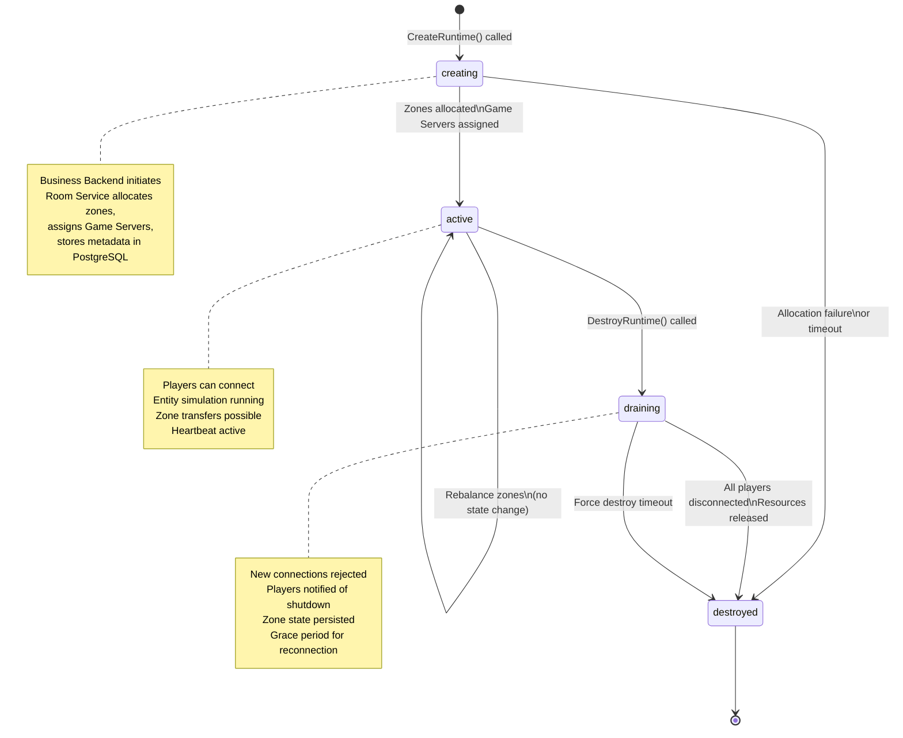
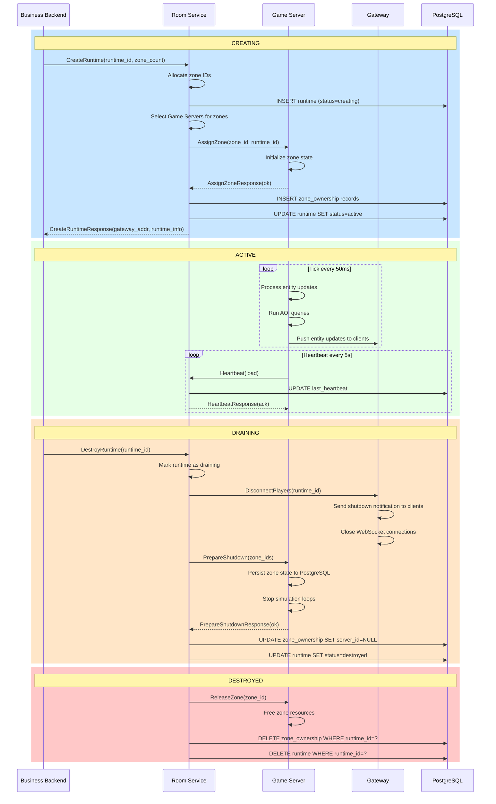

# Runtime Lifecycle Diagram

> **Last Updated:** 2026-06-26

## Runtime State Machine

## Runtime Lifecycle Swimlane

## Description

The runtime lifecycle is modeled as a four-state state machine: `creating → active → draining → destroyed`.

**Creating:** Business Backend calls `CreateRuntime()`. Room Service allocates zone IDs, selects optimal Game Servers via load-aware assignment, persists ownership records, and returns the Gateway address to the Business Backend.

**Active:** The runtime is live. Players connect via Gateway, entity simulation runs at 20 Hz, AOI queries process, and Game Servers send heartbeats every 5 seconds. Zone transfers and rebalancing occur within this state without transitioning out.

**Draining:** Business Backend calls `DestroyRuntime()`. Room Service signals Gateway to disconnect all players with a shutdown notification. Game Servers persist any dirty state, stop simulation, and acknowledge shutdown. A configurable grace period allows for reconnection attempts.

> **Note:** The `PrepareShutdown` RPC during draining (RS→GS) differs in direction from `PrepareShutdown` in ADR-009 (GS→RS, under `service RoomService`). The draining flow requires Room Service to initiate shutdown orchestration. This is tracked as a known inconsistency — ADR-009 should be updated to include a separate `DrainZones(zoneIDs)` RPC (RS→GS) for the draining path.

**Destroyed:** All resources are released: zone ownership records deleted, runtime metadata cleaned from PostgreSQL. The runtime ID becomes available for reuse.

## References

- [ADR-016](../adr/016-runtime-lifecycle.md) — Runtime Lifecycle
- [ADR-009](../adr/009-rpc-contract.md) — RPC Contract
- [Sequence Diagrams](sequences.md)
