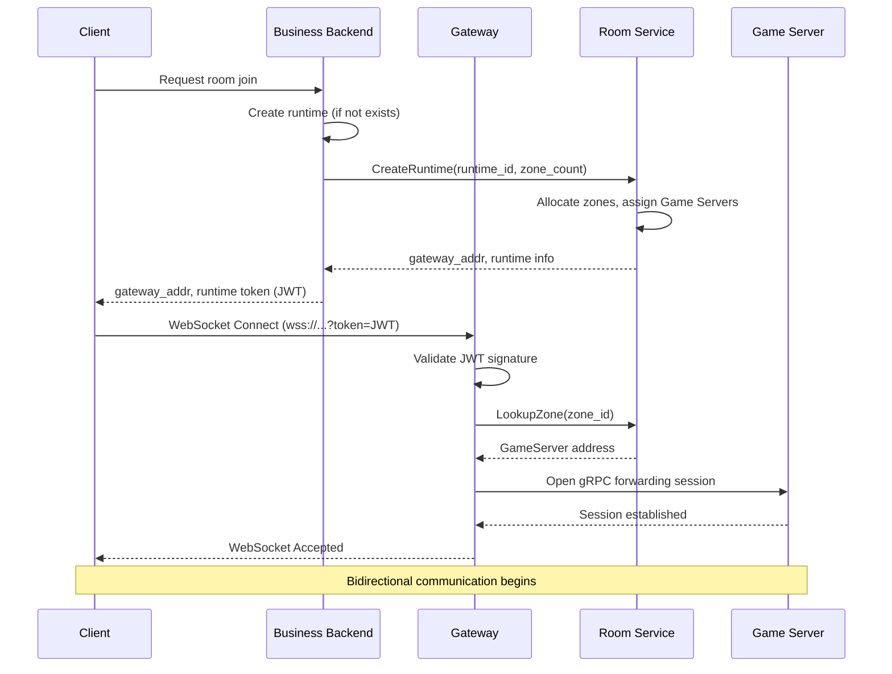
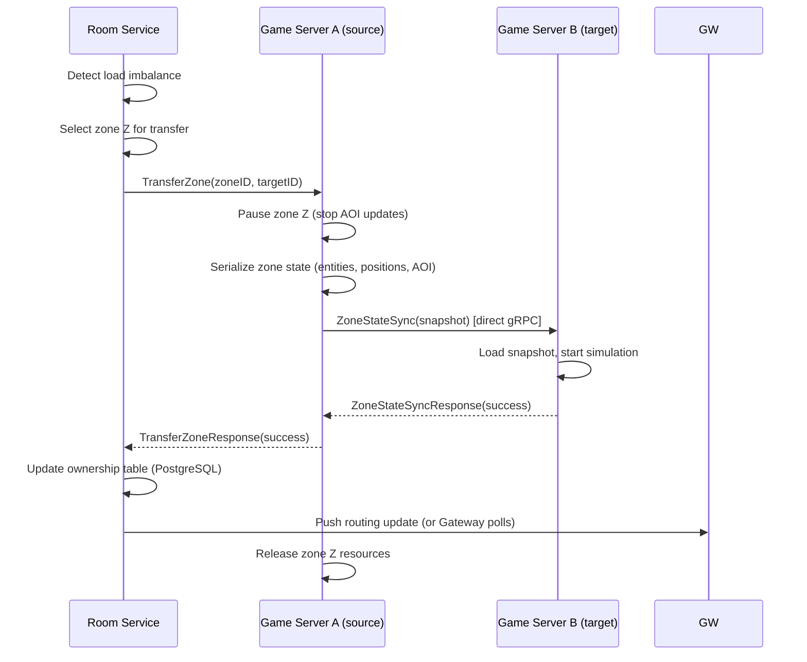
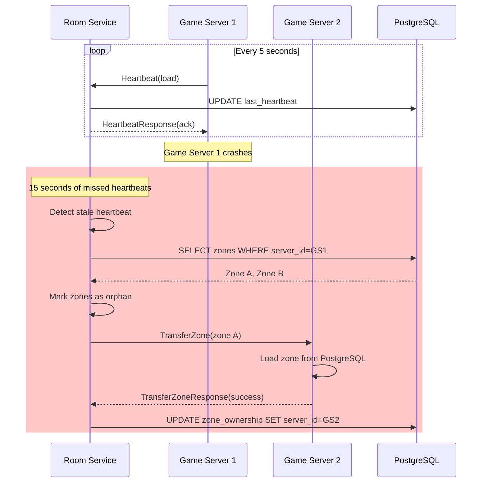
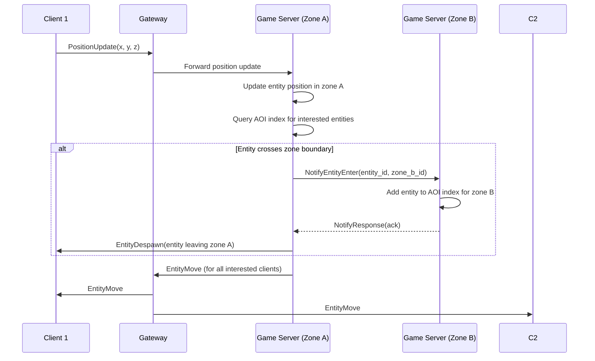
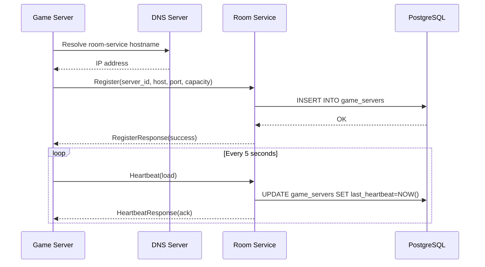

# Sequence Diagrams

> **Last Updated:** 2026-06-26

## Client Connection Flow

## Zone Transfer Flow

## Heartbeat and Crash Recovery

## AOI Update Flow

## Service Discovery Flow

## References

- [Architecture Overview](../architecture/overview.md)
- [Component Diagram](component.md)
