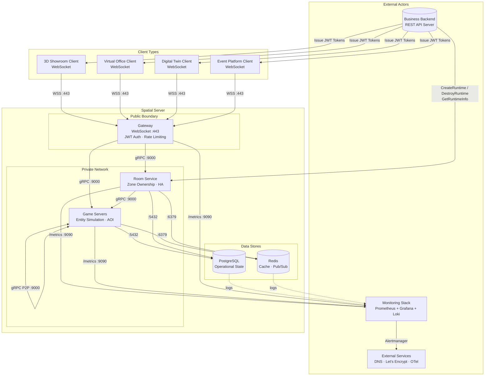

# System Context Diagram

> **Last Updated:** 2026-06-26

## Purpose

High-level C4-style system context showing Spatial Server as a black-box platform bounded by its external actors (clients, Business Backend, monitoring stack, external services) and the public/private network boundaries between them.

## Description

This C4-style system context diagram shows Spatial Server as a black-box platform bounded by four external actor groups:

- **Clients** — Four distinct client types (3D Showroom, Virtual Office, Digital Twin, Event Platform) all connecting via WebSocket over WSS :443. Each receives a JWT from the Business Backend before connecting.
- **Business Backend** — The authoritative external system that creates/destroys runtimes via Room Service and issues JWT tokens to clients. Spatial Server never contains business logic.
- **Monitoring Stack** — Prometheus collects metrics from all services; Promtail ships logs to Loki; Grafana provides dashboards.
- **External Services** — DNS resolution, Let's Encrypt TLS certificates, OpenTelemetry tracing backend.

Data flows show clear network boundary separation: clients hit the public Gateway, Gateway proxies to the private network, and data stores are accessed only by internal services.

## References

- [Architecture Overview](../architecture/overview.md)
- [ADR-015](../adr/015-architecture-principles.md) — Architecture Principles
- [ADR-013](../adr/013-platform-boundary.md) — Platform Boundary
